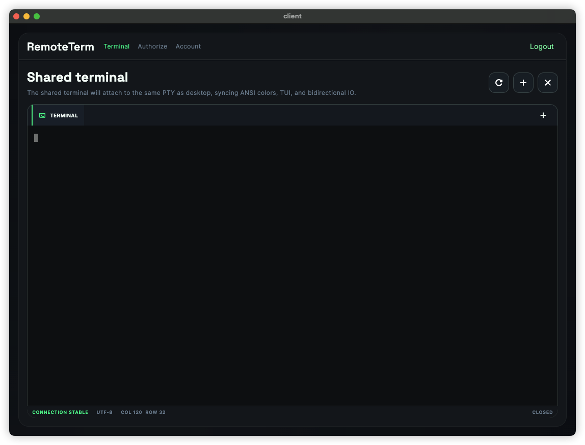

## 问题修正

### Desktop UI

目前的Flutter Desktop的桌面端UI

和设计需求doc/development/20260401/new-ui-20260401.md中的UI差很远.

请按照设计需求来做, 比如菜单应该在左侧.

### 移动端UI调整

移动端的UI也没有完全按照doc/development/20260401/new-ui-20260401.md的设计来做.

在未连接的情况下差距不大, 不过建立连接后TAB会从第一个切到其它地方, 这是不合理的, 应该继续在第一页展示远程桌面和Terminal.

然后底部TAB的选中效果也和设计存在较大差距, 应该和设计保持一致.

切换屏幕是点击左上角的屏幕Title来切换,不是右上角的菜单按钮, 右上角的菜单按钮不要.

远程桌面的窗口少了一个全屏的按钮需要补上.

然后在Monitor界面, 已连接的屏幕应该是展示视屏流, 而不是几秒一次的截屏.

