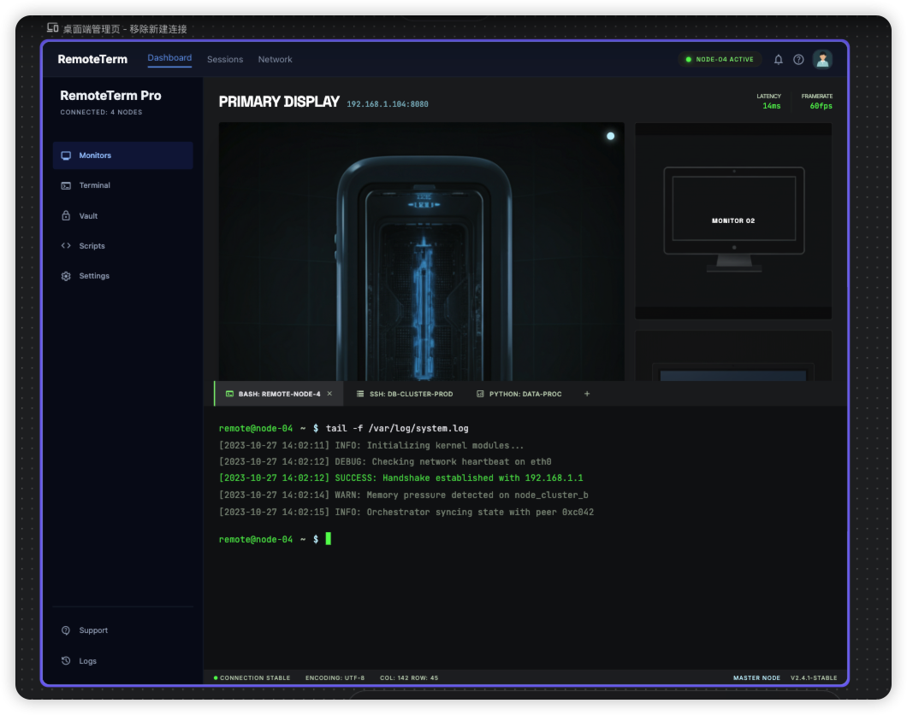
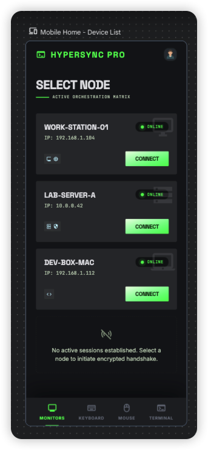
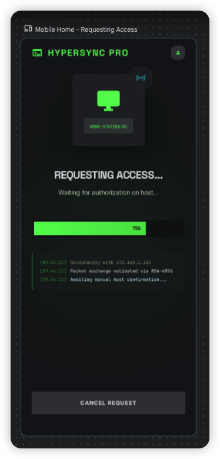
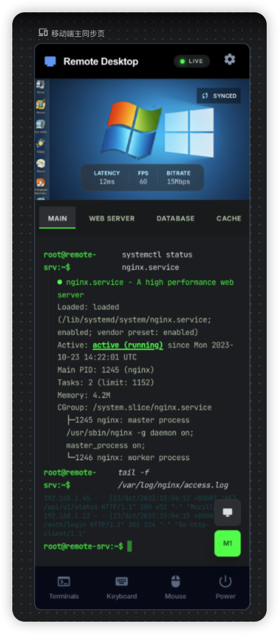
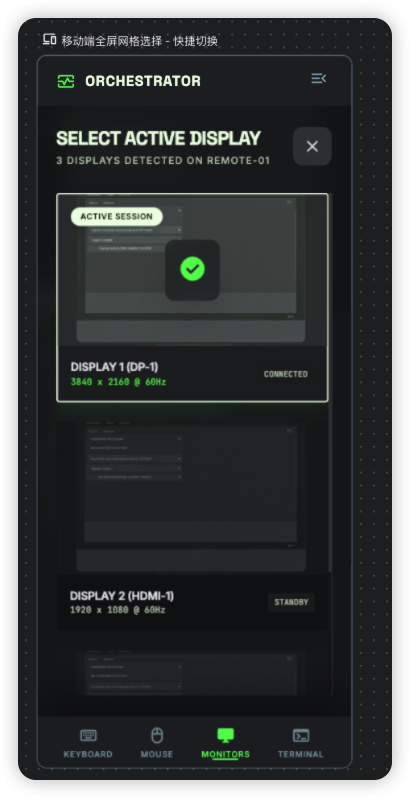
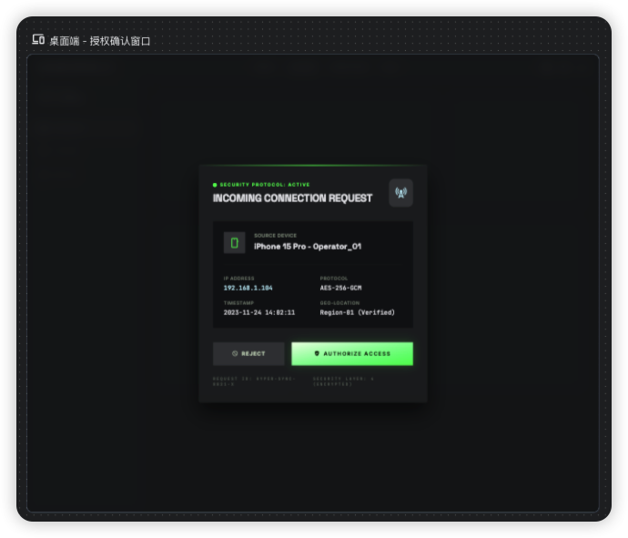

# UI 变更

当前UI有些过于简陋, 帮我按照如下方案调整.

风格样式参考下面的设计, 不过文案不用全抄.

## 登录页

参考下面的代码实现, 背景应该是有半透明效果, 可以判断一下实现难度, 如果半透明效果实现难度较大则放弃.
登录窗口应该居中而不是偏上.
然后需要有登录和注册按钮, 这可能和下面的代码有点区别, 需要的是登录和注册, 保持页面风格和下面一致即可.

### Desktop端

```html
<!DOCTYPE html>

<html class="dark" lang="en"><head>
<meta charset="utf-8"/>
<meta content="width=device-width, initial-scale=1.0" name="viewport"/>
<title>RemoteTerm Pro | Secure Access</title>
<script src="https://cdn.tailwindcss.com?plugins=forms,container-queries"></script>
<link href="https://fonts.googleapis.com/css2?family=Inter:wght@400;500;600&amp;family=Space+Grotesk:wght@500;700&amp;family=JetBrains+Mono:wght@400;500&amp;display=swap" rel="stylesheet"/>
<link href="https://fonts.googleapis.com/css2?family=Material+Symbols+Outlined:wght,FILL@100..700,0..1&amp;display=swap" rel="stylesheet"/>
<link href="https://fonts.googleapis.com/css2?family=Material+Symbols+Outlined:wght,FILL@100..700,0..1&amp;display=swap" rel="stylesheet"/>
<script id="tailwind-config">
        tailwind.config = {
            darkMode: "class",
            theme: {
                extend: {
                    colors: {
                        "on-primary": "#003907",
                        "inverse-on-surface": "#2f3034",
                        "on-primary-fixed-variant": "#00530e",
                        "surface-tint": "#00e639",
                        "on-secondary-fixed-variant": "#004f58",
                        "tertiary-container": "#d8dceb",
                        "surface-variant": "#333538",
                        "outline-variant": "#3b4b37",
                        "surface": "#111316",
                        "tertiary-fixed-dim": "#c2c6d4",
                        "primary-fixed": "#72ff70",
                        "on-primary-fixed": "#002203",
                        "surface-bright": "#37393d",
                        "inverse-primary": "#006e16",
                        "primary-container": "#00ff41",
                        "surface-container-low": "#1a1c1f",
                        "primary-fixed-dim": "#00e639",
                        "on-tertiary-container": "#5c616d",
                        "on-surface-variant": "#b9ccb2",
                        "on-surface": "#e2e2e6",
                        "background": "#111316",
                        "on-secondary-fixed": "#001f24",
                        "secondary-fixed": "#9cf0ff",
                        "primary": "#ebffe2",
                        "outline": "#84967e",
                        "surface-container-high": "#282a2d",
                        "surface-container": "#1e2023",
                        "error": "#ffb4ab",
                        "on-secondary": "#00363d",
                        "secondary-fixed-dim": "#00daf3",
                        "surface-dim": "#111316",
                        "on-error": "#690005",
                        "on-background": "#e2e2e6",
                        "tertiary-fixed": "#dee2f1",
                        "on-secondary-container": "#00616d",
                        "secondary": "#bdf4ff",
                        "on-tertiary-fixed": "#171c26",
                        "surface-container-highest": "#333538",
                        "on-tertiary": "#2b303b",
                        "secondary-container": "#00e3fd",
                        "on-tertiary-fixed-variant": "#424752",
                        "tertiary": "#f9f8ff",
                        "on-error-container": "#ffdad6",
                        "surface-container-lowest": "#0c0e11",
                        "error-container": "#93000a",
                        "on-primary-container": "#007117",
                        "inverse-surface": "#e2e2e6"
                    },
                    fontFamily: {
                        "headline": ["Space Grotesk"],
                        "body": ["Inter"],
                        "label": ["Inter"],
                        "monospace": ["JetBrains Mono"]
                    },
                    borderRadius: {
                        "DEFAULT": "0.125rem",
                        "lg": "0.25rem",
                        "xl": "0.5rem",
                        "full": "0.75rem"
                    },
                },
            },
        }
    </script>
<style>
        .glass-panel {
            background: rgba(30, 32, 35, 0.6);
            backdrop-filter: blur(20px);
            -webkit-backdrop-filter: blur(20px);
        }
        .command-btn {
            background: linear-gradient(135deg, #ebffe2 0%, #00ff41 100%);
        }
        .material-symbols-outlined {
            font-variation-settings: 'FILL' 0, 'wght' 400, 'GRAD' 0, 'opsz' 24;
        }
    </style>
</head>
<body class="bg-background text-on-surface font-body min-h-screen flex items-center justify-center">
<!-- Background Blueprint Layer (Dashboard Simulation) -->
<div class="fixed inset-0 z-0 opacity-40 blur-md pointer-events-none scale-105">
<div class="grid grid-cols-12 h-full w-full gap-4 p-8">
<div class="col-span-3 bg-surface-container-high rounded-xl"></div>
<div class="col-span-9 flex flex-col gap-4">
<div class="h-14 bg-surface-container-high rounded-lg w-full"></div>
<div class="flex-1 bg-surface-container rounded-xl flex items-center justify-center">
<div class="w-full h-full p-12 flex flex-col gap-8">
<div class="grid grid-cols-4 gap-4 h-32">
<div class="bg-surface-variant rounded-lg"></div>
<div class="bg-surface-variant rounded-lg"></div>
<div class="bg-surface-variant rounded-lg"></div>
<div class="bg-surface-variant rounded-lg"></div>
</div>
<div class="flex-1 bg-surface-container-lowest rounded-lg border border-outline-variant/10"></div>
</div>
</div>
</div>
</div>
</div>
<!-- Main Login Canvas -->
<main class="relative z-10 w-full max-w-md px-6">
<div class="glass-panel border border-outline-variant/15 p-8 rounded-xl shadow-[0px_24px_48px_rgba(0,0,0,0.4)] relative">
<!-- Brand Anchor -->
<div class="flex flex-col items-center mb-10">
<div class="w-12 h-12 bg-primary-container/20 rounded flex items-center justify-center mb-4 border border-primary-container/30">
<span class="material-symbols-outlined text-primary-fixed-dim text-3xl" data-icon="terminal">terminal</span>
</div>
<h1 class="font-headline text-3xl font-bold tracking-tight text-on-surface">RemoteTerm <span class="text-primary-fixed-dim">Pro</span></h1>
<p class="text-on-surface-variant font-label text-xs uppercase tracking-[0.1em] mt-2">Architect Orchestration Suite</p>
</div>
<!-- Authentication Form -->
<form action="#" class="space-y-6">
<!-- Email Input -->
<div class="space-y-2">
<label class="block text-xs font-label uppercase tracking-wider text-on-surface-variant ml-1" for="email">Command Identity (Email)</label>
<div class="relative group">
<div class="absolute inset-y-0 left-0 pl-4 flex items-center pointer-events-none">
<span class="material-symbols-outlined text-on-surface-variant text-lg group-focus-within:text-secondary-fixed-dim transition-colors" data-icon="alternate_email">alternate_email</span>
</div>
<input class="block w-full pl-11 pr-4 py-3.5 bg-surface-container-highest text-on-surface border-none rounded-sm focus:ring-0 focus:border-b-2 focus:border-secondary-fixed-dim font-monospace text-sm placeholder:text-on-tertiary-container transition-all" id="email" name="email" placeholder="root@remoteterm.io" required="" type="email"/>
</div>
</div>
<!-- Password Input -->
<div class="space-y-2">
<div class="flex justify-between items-center px-1">
<label class="block text-xs font-label uppercase tracking-wider text-on-surface-variant" for="password">Access Cipher (Password)</label>
<a class="text-[10px] uppercase font-bold text-secondary-fixed-dim hover:text-secondary-container transition-colors" href="#">Recover Keys?</a>
</div>
<div class="relative group">
<div class="absolute inset-y-0 left-0 pl-4 flex items-center pointer-events-none">
<span class="material-symbols-outlined text-on-surface-variant text-lg group-focus-within:text-secondary-fixed-dim transition-colors" data-icon="lock_open">lock_open</span>
</div>
<input class="block w-full pl-11 pr-4 py-3.5 bg-surface-container-highest text-on-surface border-none rounded-sm focus:ring-0 focus:border-b-2 focus:border-secondary-fixed-dim font-monospace text-sm placeholder:text-on-tertiary-container transition-all" id="password" name="password" placeholder="••••••••••••" required="" type="password"/>
</div>
</div>
<!-- Remember Me & State -->
<div class="flex items-center">
<label class="relative flex items-center cursor-pointer group">
<input class="peer sr-only" type="checkbox"/>
<div class="w-4 h-4 rounded-sm border border-outline bg-surface-container-highest peer-checked:bg-primary-container peer-checked:border-primary-container transition-all"></div>
<span class="ml-3 text-xs text-on-surface-variant group-hover:text-on-surface transition-colors">Maintain Active Session</span>
</label>
</div>
<!-- Action Button -->
<button class="command-btn w-full py-4 text-on-primary-fixed font-headline font-bold text-sm tracking-widest uppercase flex items-center justify-center gap-3 rounded-sm shadow-[0_4px_12px_rgba(0,255,65,0.2)] active:scale-95 transition-transform" type="submit">
                    Initialize Connection
                    <span class="material-symbols-outlined text-lg" data-icon="login">login</span>
</button>
</form>
<!-- Footer Navigation -->
<div class="mt-8 pt-8 border-t border-outline-variant/10 text-center">
<p class="text-on-surface-variant text-sm">
                    New operative? 
                    <a class="text-secondary-fixed font-bold hover:underline underline-offset-4 ml-1" href="#">Establish New Protocol</a>
</p>
</div>
<!-- Visual Soul (Bezel) -->
<div class="absolute inset-0 pointer-events-none rounded-xl shadow-[inset_0_1px_1px_rgba(255,255,255,0.05)] border border-white/5"></div>
</div>
<!-- System Metadata -->
<div class="absolute top-full left-0 right-0 mt-6 flex justify-between items-center px-4 text-[10px] font-monospace uppercase tracking-widest text-on-tertiary-container">
<div class="flex items-center gap-2">
<span class="w-1.5 h-1.5 rounded-full bg-primary-fixed animate-pulse"></span>
                v4.0.2 - CORE STABLE
            </div>
<div>
                ENCRYPTION: AES-256-GCM
            </div>
</div>
</main>
<!-- Decoration Element (Subtle Gradient Glows) -->
<div class="fixed bottom-0 left-1/2 -translate-x-1/2 w-full max-w-4xl h-64 bg-primary-container/10 blur-[120px] rounded-full pointer-events-none opacity-20"></div>
</body></html>
```

### 移动端

```html
<!DOCTYPE html>

<html class="dark" lang="en"><head>
<meta charset="utf-8"/>
<meta content="width=device-width, initial-scale=1.0" name="viewport"/>
<title>HyperSync Pro - Remote Desktop Login</title>
<link href="https://fonts.googleapis.com" rel="preconnect"/>
<link crossorigin="" href="https://fonts.gstatic.com" rel="preconnect"/>
<link href="https://fonts.googleapis.com/css2?family=Inter:wght@400;500;600;700&amp;family=Space+Grotesk:wght@500;700&amp;family=JetBrains+Mono:wght@400;500&amp;display=swap" rel="stylesheet"/>
<link href="https://fonts.googleapis.com/css2?family=Material+Symbols+Outlined:wght,FILL@100..700,0..1&amp;display=swap" rel="stylesheet"/>
<link href="https://fonts.googleapis.com/css2?family=Material+Symbols+Outlined:wght,FILL@100..700,0..1&amp;display=swap" rel="stylesheet"/>
<script src="https://cdn.tailwindcss.com?plugins=forms,container-queries"></script>
<script id="tailwind-config">
      tailwind.config = {
        darkMode: "class",
        theme: {
          extend: {
            colors: {
              "on-primary": "#003907",
              "inverse-on-surface": "#2f3034",
              "on-primary-fixed-variant": "#00530e",
              "surface-tint": "#00e639",
              "on-secondary-fixed-variant": "#004f58",
              "tertiary-container": "#d8dceb",
              "surface-variant": "#333538",
              "outline-variant": "#3b4b37",
              "surface": "#111316",
              "tertiary-fixed-dim": "#c2c6d4",
              "primary-fixed": "#72ff70",
              "on-primary-fixed": "#002203",
              "surface-bright": "#37393d",
              "inverse-primary": "#006e16",
              "primary-container": "#00ff41",
              "surface-container-low": "#1a1c1f",
              "primary-fixed-dim": "#00e639",
              "on-tertiary-container": "#5c616d",
              "on-surface-variant": "#b9ccb2",
              "on-surface": "#e2e2e6",
              "background": "#111316",
              "on-secondary-fixed": "#001f24",
              "secondary-fixed": "#9cf0ff",
              "primary": "#ebffe2",
              "outline": "#84967e",
              "surface-container-high": "#282a2d",
              "surface-container": "#1e2023",
              "error": "#ffb4ab",
              "on-secondary": "#00363d",
              "secondary-fixed-dim": "#00daf3",
              "surface-dim": "#111316",
              "on-error": "#690005",
              "on-background": "#e2e2e6",
              "tertiary-fixed": "#dee2f1",
              "on-secondary-container": "#00616d",
              "secondary": "#bdf4ff",
              "on-tertiary-fixed": "#171c26",
              "surface-container-highest": "#333538",
              "on-tertiary": "#2b303b",
              "secondary-container": "#00e3fd",
              "on-tertiary-fixed-variant": "#424752",
              "tertiary": "#f9f8ff",
              "on-error-container": "#ffdad6",
              "surface-container-lowest": "#0c0e11",
              "error-container": "#93000a",
              "on-primary-container": "#007117",
              "inverse-surface": "#e2e2e6"
            },
            fontFamily: {
              "headline": ["Space Grotesk"],
              "body": ["Inter"],
              "label": ["Inter"],
              "mono": ["JetBrains Mono"]
            },
            borderRadius: {"DEFAULT": "0.125rem", "lg": "0.25rem", "xl": "0.5rem", "full": "0.75rem"},
          },
        },
      }
    </script>
<style>
        .material-symbols-outlined {
            font-variation-settings: 'FILL' 0, 'wght' 400, 'GRAD' 0, 'opsz' 24;
            display: inline-block;
            line-height: 1;
            text-transform: none;
            letter-spacing: normal;
            word-wrap: normal;
            white-space: nowrap;
            direction: ltr;
        }
        .glass-effect {
            backdrop-filter: blur(20px);
            background: rgba(30, 32, 35, 0.6);
        }
        .inner-glow {
            box-shadow: inset 0 1px 1px rgba(255, 255, 255, 0.05);
        }
        .primary-gradient {
            background: linear-gradient(135deg, #ebffe2 0%, #00ff41 100%);
        }
    </style>
<style>
    body {
      min-height: max(884px, 100dvh);
    }
  </style>
  </head>
<body class="bg-background text-on-surface font-body min-h-screen flex flex-col items-center justify-center p-6 antialiased">
<!-- Abstract Background Pattern -->
<div class="fixed inset-0 overflow-hidden pointer-events-none z-0">
<div class="absolute top-[-10%] right-[-10%] w-[500px] h-[500px] rounded-full bg-primary-fixed-dim/5 blur-[120px]"></div>
<div class="absolute bottom-[-10%] left-[-10%] w-[400px] h-[400px] rounded-full bg-secondary-fixed-dim/5 blur-[100px]"></div>
</div>
<!-- Main Auth Container -->
<main class="relative z-10 w-full max-w-md">
<!-- Brand Header -->
<header class="flex flex-col items-center mb-12">
<div class="w-16 h-16 bg-surface-container-high inner-glow rounded-xl flex items-center justify-center mb-6 shadow-2xl">
<span class="material-symbols-outlined text-primary-container text-4xl" data-icon="monitor_heart">monitor_heart</span>
</div>
<h1 class="font-headline text-4xl font-bold tracking-tight text-white mb-2">
                HyperSync <span class="text-primary-container">Pro</span>
</h1>
<p class="text-on-surface-variant font-mono text-xs uppercase tracking-widest">
                Secure Remote Orchestration
            </p>
</header>
<!-- Login Form Card -->
<section class="bg-surface-container rounded-xl p-8 inner-glow shadow-2xl">
<div class="mb-8">
<h2 class="font-headline text-xl font-bold text-white mb-1">Welcome back</h2>
<p class="text-on-surface-variant text-sm">Enter your credentials to access the terminal.</p>
</div>
<form class="space-y-6">
<!-- Email Field -->
<div class="space-y-2">
<label class="block text-[11px] font-semibold text-on-surface-variant uppercase tracking-wider px-1">
                        Network ID / Email
                    </label>
<div class="relative">
<span class="material-symbols-outlined absolute left-4 top-1/2 -translate-y-1/2 text-on-surface-variant text-xl" data-icon="alternate_email">alternate_email</span>
<input class="w-full bg-surface-container-highest border-none rounded text-sm py-4 pl-12 pr-4 focus:ring-0 focus:ring-offset-0 focus:border-b-2 focus:border-secondary transition-all placeholder:text-on-tertiary-container" placeholder="admin@hypersync.pro" type="email"/>
</div>
</div>
<!-- Password Field -->
<div class="space-y-2">
<div class="flex justify-between items-center px-1">
<label class="text-[11px] font-semibold text-on-surface-variant uppercase tracking-wider">
                            Passkey
                        </label>
<a class="text-[11px] font-semibold text-secondary hover:text-secondary-fixed-dim transition-colors uppercase tracking-wider" href="#">
                            Forgot?
                        </a>
</div>
<div class="relative">
<span class="material-symbols-outlined absolute left-4 top-1/2 -translate-y-1/2 text-on-surface-variant text-xl" data-icon="vpn_key">vpn_key</span>
<input class="w-full bg-surface-container-highest border-none rounded text-sm py-4 pl-12 pr-4 focus:ring-0 focus:ring-offset-0 focus:border-b-2 focus:border-secondary transition-all placeholder:text-on-tertiary-container" placeholder="••••••••••••" type="password"/>
</div>
</div>
<!-- Action Button -->
<button class="w-full primary-gradient text-on-primary-fixed font-bold py-4 rounded-sm text-sm uppercase tracking-widest shadow-lg shadow-primary-container/10 active:scale-95 transition-transform" type="submit">
                    Sign In
                </button>
</form>
<div class="mt-10 pt-6 border-t border-outline-variant/15 flex flex-col items-center gap-4">
<p class="text-on-surface-variant text-sm">
                    New operator? 
                    <a class="text-secondary font-bold hover:underline underline-offset-4 ml-1 transition-all" href="#">Create Account</a>
</p>
<!-- Social Login Tonal -->
<div class="flex items-center w-full gap-4 py-4">
<div class="h-[1px] bg-outline-variant/20 flex-grow"></div>
<span class="text-[10px] font-mono text-on-tertiary-container uppercase">Or Sync with</span>
<div class="h-[1px] bg-outline-variant/20 flex-grow"></div>
</div>
<div class="flex gap-4 w-full">
<button class="flex-1 bg-surface-container-high hover:bg-surface-bright transition-colors rounded-sm py-3 flex items-center justify-center gap-2 group">
<span class="material-symbols-outlined text-xl text-on-surface-variant group-hover:text-white transition-colors" data-icon="terminal">terminal</span>
<span class="text-[11px] font-bold text-on-surface-variant group-hover:text-white uppercase tracking-tighter">SSH Key</span>
</button>
<button class="flex-1 bg-surface-container-high hover:bg-surface-bright transition-colors rounded-sm py-3 flex items-center justify-center gap-2 group">
<span class="material-symbols-outlined text-xl text-on-surface-variant group-hover:text-white transition-colors" data-icon="cloud">cloud</span>
<span class="text-[11px] font-bold text-on-surface-variant group-hover:text-white uppercase tracking-tighter">Identity</span>
</button>
</div>
</div>
</section>
<!-- Connection Status Footer -->
<footer class="mt-12 flex flex-col items-center gap-4">
<div class="flex items-center gap-3 px-4 py-2 bg-surface-container-low rounded-full border border-outline-variant/10">
<span class="relative flex h-2 w-2">
<span class="animate-ping absolute inline-flex h-full w-full rounded-full bg-primary-container opacity-75"></span>
<span class="relative inline-flex rounded-full h-2 w-2 bg-primary-container"></span>
</span>
<span class="font-mono text-[10px] text-on-surface-variant tracking-wider uppercase">
                    Central Node: Active | Latency 14ms
                </span>
</div>
<p class="text-[10px] text-on-tertiary-container text-center leading-relaxed max-w-[280px]">
                By accessing this portal you agree to the <br/>
<a class="underline" href="#">Security Protocols</a> and <a class="underline" href="#">Privacy Encryption</a>.
            </p>
</footer>
</main>
<!-- Visual Polish: Ghost images for background texture -->
<div class="fixed top-20 left-10 opacity-10 pointer-events-none mix-blend-screen hidden lg:block">

</div>
<div class="fixed bottom-20 right-10 opacity-10 pointer-events-none mix-blend-screen hidden lg:block">

</div>
</body></html>
```

## 主页

### 桌面端主页



```html
<!DOCTYPE html>

<html class="dark" lang="en"><head>
<meta charset="utf-8"/>
<meta content="width=device-width, initial-scale=1.0" name="viewport"/>
<title>RemoteTerm Pro | Management Console</title>
<script src="https://cdn.tailwindcss.com?plugins=forms,container-queries"></script>
<link href="https://fonts.googleapis.com/css2?family=Space+Grotesk:wght@300;400;500;600;700&amp;family=Inter:wght@300;400;500;600;700&amp;family=JetBrains+Mono:wght@400;500&amp;display=swap" rel="stylesheet"/>
<link href="https://fonts.googleapis.com/css2?family=Material+Symbols+Outlined:wght,FILL@100..700,0..1&amp;display=swap" rel="stylesheet"/>
<script id="tailwind-config">
      tailwind.config = {
        darkMode: "class",
        theme: {
          extend: {
            colors: {
              "on-primary": "#003907",
              "inverse-on-surface": "#2f3034",
              "on-primary-fixed-variant": "#00530e",
              "surface-tint": "#00e639",
              "on-secondary-fixed-variant": "#004f58",
              "tertiary-container": "#d8dceb",
              "surface-variant": "#333538",
              "outline-variant": "#3b4b37",
              "surface": "#111316",
              "tertiary-fixed-dim": "#c2c6d4",
              "primary-fixed": "#72ff70",
              "on-primary-fixed": "#002203",
              "surface-bright": "#37393d",
              "inverse-primary": "#006e16",
              "primary-container": "#00ff41",
              "surface-container-low": "#1a1c1f",
              "primary-fixed-dim": "#00e639",
              "on-tertiary-container": "#5c616d",
              "on-surface-variant": "#b9ccb2",
              "on-surface": "#e2e2e6",
              "background": "#111316",
              "on-secondary-fixed": "#001f24",
              "secondary-fixed": "#9cf0ff",
              "primary": "#ebffe2",
              "outline": "#84967e",
              "surface-container-high": "#282a2d",
              "surface-container": "#1e2023",
              "error": "#ffb4ab",
              "on-secondary": "#00363d",
              "secondary-fixed-dim": "#00_daf3",
              "surface-dim": "#111316",
              "on-error": "#690005",
              "on-background": "#e2e2e6",
              "tertiary-fixed": "#dee2f1",
              "on-secondary-container": "#00616d",
              "secondary": "#bdf4ff",
              "on-tertiary-fixed": "#171c26",
              "surface-container-highest": "#333538",
              "on-tertiary": "#2b303b",
              "secondary-container": "#00e3fd",
              "on-tertiary-fixed-variant": "#424752",
              "tertiary": "#f9f8ff",
              "on-error-container": "#ffdad6",
              "surface-container-lowest": "#0c0e11",
              "error-container": "#93000a",
              "on-primary-container": "#007117",
              "inverse-surface": "#e2e2e6"
            },
            fontFamily: {
              "headline": ["Space Grotesk"],
              "body": ["Inter"],
              "label": ["Inter"],
              "mono": ["JetBrains Mono"]
            },
            borderRadius: {"DEFAULT": "0.125rem", "lg": "0.25rem", "xl": "0.5rem", "full": "0.75rem"},
          },
        },
      }
    </script>
<style>
        body { font-family: 'Inter', sans-serif; }
        .font-headline { font-family: 'Space Grotesk', sans-serif; }
        .font-mono { font-family: 'JetBrains Mono', monospace; }
        .glass-panel {
            background: rgba(51, 53, 56, 0.6);
            backdrop-filter: blur(20px);
        }
        /* Custom scrollbar for terminal look */
        ::-webkit-scrollbar { width: 4px; height: 4px; }
        ::-webkit-scrollbar-track { background: #111316; }
        ::-webkit-scrollbar-thumb { background: #333538; border-radius: 2px; }
        ::-webkit-scrollbar-thumb:hover { background: #00ff41; }
    </style>
</head>
<body class="bg-surface text-on-surface select-none overflow-hidden h-screen w-screen flex flex-col">
<!-- TopNavBar -->
<header class="bg-slate-50 dark:bg-slate-900 border-b border-slate-200 dark:border-slate-800 flex justify-between items-center px-6 h-14 w-full z-50">
<div class="flex items-center gap-8">
<h1 class="text-lg font-bold text-slate-900 dark:text-white">RemoteTerm</h1>
<nav class="hidden md:flex items-center gap-6 font-sans text-sm antialiased">
<a class="text-blue-600 dark:text-blue-400 border-b-2 border-blue-600 dark:border-blue-400 pb-1 cursor-pointer active:opacity-70 transition-colors" href="#">Dashboard</a>
<a class="text-slate-500 dark:text-slate-400 hover:text-blue-500 dark:hover:text-blue-300 transition-colors cursor-pointer active:opacity-70" href="#">Sessions</a>
<a class="text-slate-500 dark:text-slate-400 hover:text-blue-500 dark:hover:text-blue-300 transition-colors cursor-pointer active:opacity-70" href="#">Network</a>
</nav>
</div>
<div class="flex items-center gap-4">
<div class="flex items-center gap-2 px-3 py-1 bg-surface-container rounded-full border border-outline-variant/20">
<span class="w-2 h-2 rounded-full bg-primary-container shadow-[0_0_8px_#00ff41]"></span>
<span class="text-[10px] font-headline uppercase tracking-widest text-primary-fixed">Node-04 Active</span>
</div>
<div class="flex items-center gap-3">
<span class="material-symbols-outlined text-slate-500 dark:text-slate-400 hover:text-blue-500 cursor-pointer text-xl">notifications</span>
<span class="material-symbols-outlined text-slate-500 dark:text-slate-400 hover:text-blue-500 cursor-pointer text-xl">help</span>
<div class="w-8 h-8 rounded-full overflow-hidden border border-slate-700">

</div>
</div>
</div>
</header>
<div class="flex-1 flex overflow-hidden">
<!-- SideNavBar -->
<aside class="bg-slate-100 dark:bg-slate-950 w-64 border-r border-slate-200 dark:border-slate-800 flex flex-col h-full p-4 gap-2">
<div class="mb-8 px-3">
<h2 class="text-xl font-black text-slate-800 dark:text-slate-100">RemoteTerm Pro</h2>
<p class="text-[10px] text-slate-500 dark:text-slate-400 uppercase tracking-widest mt-1">Connected: 4 Nodes</p>
</div>
<div class="flex flex-col gap-1 font-sans font-medium text-xs">
<a class="flex items-center gap-3 bg-blue-100 dark:bg-blue-900/30 text-blue-700 dark:text-blue-300 rounded-lg px-3 py-2 transition-all" href="#">
<span class="material-symbols-outlined text-lg">monitor</span>
                    Monitors
                </a>
<a class="flex items-center gap-3 text-slate-600 dark:text-slate-400 px-3 py-2 hover:bg-slate-200 dark:hover:bg-slate-800/50 rounded-lg transition-all active:scale-95" href="#">
<span class="material-symbols-outlined text-lg">terminal</span>
                    Terminal
                </a>
<a class="flex items-center gap-3 text-slate-600 dark:text-slate-400 px-3 py-2 hover:bg-slate-200 dark:hover:bg-slate-800/50 rounded-lg transition-all active:scale-95" href="#">
<span class="material-symbols-outlined text-lg">lock</span>
                    Vault
                </a>
<a class="flex items-center gap-3 text-slate-600 dark:text-slate-400 px-3 py-2 hover:bg-slate-200 dark:hover:bg-slate-800/50 rounded-lg transition-all active:scale-95" href="#">
<span class="material-symbols-outlined text-lg">code</span>
                    Scripts
                </a>
<a class="flex items-center gap-3 text-slate-600 dark:text-slate-400 px-3 py-2 hover:bg-slate-200 dark:hover:bg-slate-800/50 rounded-lg transition-all active:scale-95" href="#">
<span class="material-symbols-outlined text-lg">settings</span>
                    Settings
                </a>
</div>
<div class="mt-auto pt-4 border-t border-slate-200 dark:border-slate-800 flex flex-col gap-1">
<a class="flex items-center gap-3 text-slate-600 dark:text-slate-400 px-3 py-2 hover:bg-slate-200 dark:hover:bg-slate-800/50 rounded-lg transition-all text-xs" href="#">
<span class="material-symbols-outlined text-lg">contact_support</span>
                    Support
                </a>
<a class="flex items-center gap-3 text-slate-600 dark:text-slate-400 px-3 py-2 hover:bg-slate-200 dark:hover:bg-slate-800/50 rounded-lg transition-all text-xs" href="#">
<span class="material-symbols-outlined text-lg">history</span>
                    Logs
                </a>
</div>
</aside>
<!-- Main Content Area -->
<main class="flex-1 flex flex-col bg-surface-container-low overflow-hidden">
<!-- Top Section: Monitor Display Status -->
<section class="h-1/2 p-6 flex flex-col gap-4 overflow-hidden">
<div class="flex items-center justify-between">
<div class="flex items-baseline gap-3">
<h3 class="font-headline text-2xl font-bold tracking-tight text-white uppercase">Primary Display</h3>
<span class="text-xs font-mono text-secondary-fixed opacity-70">192.168.1.104:8080</span>
</div>
<div class="flex gap-2">
<div class="flex flex-col items-end">
<span class="text-[9px] uppercase tracking-tighter text-on-surface-variant">Latency</span>
<span class="text-xs font-mono text-primary-container">14ms</span>
</div>
<div class="w-[1px] h-8 bg-outline-variant/30 self-center mx-2"></div>
<div class="flex flex-col items-end">
<span class="text-[9px] uppercase tracking-tighter text-on-surface-variant">Framerate</span>
<span class="text-xs font-mono text-primary-container">60fps</span>
</div>
</div>
</div>
<!-- Bento Monitor Grid -->
<div class="flex-1 grid grid-cols-12 gap-4">
<!-- Main Stream -->
<div class="col-span-8 relative group rounded-lg overflow-hidden bg-surface-container-lowest shadow-2xl">

<!-- Overlay Toolbar -->
<div class="absolute bottom-4 left-1/2 -translate-x-1/2 glass-panel px-4 py-2 rounded-full border border-white/10 flex items-center gap-6 shadow-2xl">
<button class="material-symbols-outlined text-white hover:text-primary-container transition-colors">videocam</button>
<button class="material-symbols-outlined text-white hover:text-primary-container transition-colors">mic</button>
<button class="material-symbols-outlined text-white hover:text-primary-container transition-colors">desktop_windows</button>
<div class="w-[1px] h-4 bg-white/20"></div>
<button class="material-symbols-outlined text-error hover:scale-110 transition-transform">call_end</button>
</div>
<!-- Signal Status Glow -->
<div class="absolute top-4 right-4 w-3 h-3 rounded-full bg-secondary shadow-[0_0_12px_#bdf4ff]"></div>
</div>
<!-- Secondary Monitor Previews -->
<div class="col-span-4 flex flex-col gap-4">
<div class="flex-1 relative rounded-lg overflow-hidden bg-surface-container-high border border-outline-variant/10 group">

<div class="absolute inset-0 flex items-center justify-center bg-black/40">
<span class="text-[10px] font-headline font-bold text-white uppercase tracking-widest">Monitor 02</span>
</div>
</div>
<div class="flex-1 relative rounded-lg overflow-hidden bg-surface-container-high border border-outline-variant/10 group">

<div class="absolute inset-0 flex items-center justify-center bg-black/40">
<span class="text-[10px] font-headline font-bold text-white uppercase tracking-widest">Monitor 03</span>
</div>
</div>
</div>
</div>
</section>
<!-- Bottom Section: Terminal Interface -->
<section class="h-1/2 flex flex-col bg-surface-container-lowest">
<!-- Terminal Tabs -->
<div class="flex items-center px-4 bg-surface-container-low h-10 gap-1">
<div class="px-4 h-full flex items-center gap-2 bg-surface-container-highest border-l-2 border-primary-fixed cursor-default">
<span class="material-symbols-outlined text-sm text-primary-fixed">terminal</span>
<span class="text-[10px] font-label font-bold uppercase tracking-wider text-on-surface">bash: remote-node-4</span>
<span class="material-symbols-outlined text-xs text-on-surface-variant hover:text-white cursor-pointer">close</span>
</div>
<div class="px-4 h-full flex items-center gap-2 hover:bg-surface-bright transition-colors cursor-pointer text-on-surface-variant">
<span class="material-symbols-outlined text-sm">storage</span>
<span class="text-[10px] font-label font-medium uppercase tracking-wider">ssh: db-cluster-prod</span>
</div>
<div class="px-4 h-full flex items-center gap-2 hover:bg-surface-bright transition-colors cursor-pointer text-on-surface-variant">
<span class="material-symbols-outlined text-sm">analytics</span>
<span class="text-[10px] font-label font-medium uppercase tracking-wider">python: data-proc</span>
</div>
<button class="ml-2 w-6 h-6 flex items-center justify-center rounded hover:bg-surface-variant text-on-surface-variant">
<span class="material-symbols-outlined text-sm">add</span>
</button>
</div>
<!-- Terminal Console Body -->
<div class="flex-1 p-6 font-mono text-sm leading-relaxed overflow-y-auto scrollbar-thin">
<div class="flex flex-col gap-1">
<div class="flex gap-3">
<span class="text-primary-fixed-dim">remote@node-04</span>
<span class="text-on-surface-variant">~</span>
<span class="text-secondary">$</span>
<span class="text-on-surface">tail -f /var/log/system.log</span>
</div>
<p class="text-on-surface-variant/60">[2023-10-27 14:02:11] INFO: Initializing kernel modules...</p>
<p class="text-on-surface-variant/60">[2023-10-27 14:02:12] DEBUG: Checking network heartbeat on eth0</p>
<p class="text-primary-container/80">[2023-10-27 14:02:12] SUCCESS: Handshake established with 192.168.1.1</p>
<p class="text-on-surface-variant/60">[2023-10-27 14:02:14] WARN: Memory pressure detected on node_cluster_b</p>
<p class="text-on-surface-variant/60">[2023-10-27 14:02:15] INFO: Orchestrator syncing state with peer 0xc042</p>
<div class="flex gap-3 mt-4">
<span class="text-primary-fixed-dim">remote@node-04</span>
<span class="text-on-surface-variant">~</span>
<span class="text-secondary">$</span>
<span class="w-2 h-5 bg-primary-container animate-pulse"></span>
</div>
</div>
</div>
<!-- Terminal Status Bar -->
<div class="h-6 px-4 bg-surface-container flex items-center justify-between text-[9px] font-label uppercase tracking-[0.1em] text-on-surface-variant border-t border-outline-variant/10">
<div class="flex gap-6">
<span class="flex items-center gap-1"><span class="w-1.5 h-1.5 rounded-full bg-primary-container"></span> Connection Stable</span>
<span>Encoding: UTF-8</span>
<span>Col: 142  Row: 45</span>
</div>
<div class="flex gap-4">
<span class="text-secondary">Master Node</span>
<span>v2.4.1-stable</span>
</div>
</div>
</section>
</main>
</div>
</body></html>
```

### 移动端主页

#### 未连接



```html
<!DOCTYPE html>

<html class="dark" lang="en"><head>
<meta charset="utf-8"/>
<meta content="width=device-width, initial-scale=1.0" name="viewport"/>
<title>HyperSync Pro - Node Selection</title>
<script src="https://cdn.tailwindcss.com?plugins=forms,container-queries"></script>
<link href="https://fonts.googleapis.com/css2?family=Inter:wght@400;500;600;700&amp;family=Space+Grotesk:wght@300;400;500;600;700&amp;family=JetBrains+Mono:wght@400;500&amp;display=swap" rel="stylesheet"/>
<link href="https://fonts.googleapis.com/css2?family=Material+Symbols+Outlined:wght,FILL@100..700,0..1&amp;display=swap" rel="stylesheet"/>
<link href="https://fonts.googleapis.com/css2?family=Material+Symbols+Outlined:wght,FILL@100..700,0..1&amp;display=swap" rel="stylesheet"/>
<script id="tailwind-config">
        tailwind.config = {
            darkMode: "class",
            theme: {
                extend: {
                    colors: {
                        "surface-dim": "#111316",
                        "surface-container": "#1e2023",
                        "on-tertiary-fixed": "#171c26",
                        "on-error": "#690005",
                        "on-surface-variant": "#b9ccb2",
                        "inverse-surface": "#e2e2e6",
                        "error": "#ffb4ab",
                        "surface-container-low": "#1a1c1f",
                        "secondary-fixed": "#9cf0ff",
                        "on-tertiary-container": "#5c616d",
                        "on-primary-fixed-variant": "#00530e",
                        "outline-variant": "#3b4b37",
                        "tertiary-fixed": "#dee2f1",
                        "primary-fixed-dim": "#00e639",
                        "on-secondary": "#00363d",
                        "surface-tint": "#00e639",
                        "error-container": "#93000a",
                        "outline": "#84967e",
                        "secondary-container": "#00e3fd",
                        "on-primary": "#003907",
                        "on-secondary-container": "#00616d",
                        "primary-container": "#00ff41",
                        "on-surface": "#e2e2e6",
                        "tertiary-fixed-dim": "#c2c6d4",
                        "on-error-container": "#ffdad6",
                        "background": "#111316",
                        "tertiary": "#f9f8ff",
                        "surface-container-lowest": "#0c0e11",
                        "on-primary-fixed": "#002203",
                        "secondary": "#bdf4ff",
                        "on-secondary-fixed": "#001f24",
                        "surface-bright": "#37393d",
                        "on-primary-container": "#007117",
                        "on-tertiary": "#2b303b",
                        "inverse-on-surface": "#2f3034",
                        "secondary-fixed-dim": "#00daf3",
                        "on-tertiary-fixed-variant": "#424752",
                        "surface-container-high": "#282a2d",
                        "surface": "#111316",
                        "surface-container-highest": "#333538",
                        "tertiary-container": "#d8dceb",
                        "inverse-primary": "#006e16",
                        "primary-fixed": "#72ff70",
                        "on-secondary-fixed-variant": "#004f58",
                        "primary": "#ebffe2",
                        "on-background": "#e2e2e6",
                        "surface-variant": "#333538"
                    },
                    fontFamily: {
                        "headline": ["Space Grotesk"],
                        "body": ["Inter"],
                        "label": ["Inter"],
                        "mono": ["JetBrains Mono"]
                    },
                    borderRadius: { "DEFAULT": "0.125rem", "lg": "0.25rem", "xl": "0.5rem", "full": "0.75rem" },
                },
            },
        }
    </script>
<style>
        .material-symbols-outlined {
            font-variation-settings: 'FILL' 0, 'wght' 400, 'GRAD' 0, 'opsz' 24;
        }
        .pulse-green {
            box-shadow: 0 0 0 0 rgba(0, 255, 65, 0.7);
            animation: pulse 2s infinite;
        }
        @keyframes pulse {
            0% { transform: scale(0.95); box-shadow: 0 0 0 0 rgba(0, 255, 65, 0.7); }
            70% { transform: scale(1); box-shadow: 0 0 0 6px rgba(0, 255, 65, 0); }
            100% { transform: scale(0.95); box-shadow: 0 0 0 0 rgba(0, 255, 65, 0); }
        }
        .glass-panel {
            background: rgba(51, 53, 56, 0.6);
            backdrop-filter: blur(20px);
        }
        .text-glow {
            text-shadow: 0 0 10px rgba(0, 255, 65, 0.5);
        }
    </style>
<style>
    body {
      min-height: max(884px, 100dvh);
    }
  </style>
  </head>
<body class="bg-background text-on-background font-body min-h-screen flex flex-col overflow-x-hidden">
<!-- TopAppBar -->
<header class="bg-[#111316] dark:bg-[#111316] docked full-width top-0 z-50 shadow-none">
<div class="flex justify-between items-center w-full px-6 py-4">
<div class="flex items-center gap-3">
<span class="material-symbols-outlined text-[#00FF41]" data-icon="terminal">terminal</span>
<h1 class="text-xl font-bold text-[#00FF41] uppercase tracking-widest font-['Space_Grotesk'] tracking-tight">HyperSync Pro</h1>
</div>
<div class="w-8 h-8 rounded-full overflow-hidden border border-outline-variant/30 active:scale-95 duration-150 transition-colors hover:bg-[#333538]">

</div>
</div>
</header>
<!-- Main Content Area -->
<main class="flex-1 px-6 pt-6 pb-32 max-w-2xl mx-auto w-full">
<!-- Section Header -->
<div class="mb-8 space-y-1">
<h2 class="font-headline text-3xl font-bold tracking-tight text-on-surface">SELECT NODE</h2>
<div class="flex items-center gap-2">
<div class="h-[2px] w-8 bg-primary-container"></div>
<p class="font-mono text-[10px] text-on-surface-variant uppercase tracking-widest">Active Orchestration Matrix</p>
</div>
</div>
<!-- Node List -->
<div class="space-y-4">
<!-- Node 01 -->
<div class="bg-surface-container-high rounded-lg p-5 flex flex-col gap-4 relative overflow-hidden group transition-all duration-300 hover:bg-surface-bright">
<div class="flex justify-between items-start">
<div class="space-y-1">
<h3 class="font-headline font-bold text-lg text-on-surface">WORK-STATION-01</h3>
<p class="font-mono text-xs text-on-surface-variant">IP: 192.168.1.104</p>
</div>
<div class="flex items-center gap-2 bg-surface-container-lowest px-3 py-1 rounded-full border border-outline-variant/15">
<div class="w-2 h-2 rounded-full bg-primary-container pulse-green"></div>
<span class="font-mono text-[10px] font-bold text-primary-container tracking-wider">ONLINE</span>
</div>
</div>
<div class="flex items-center justify-between pt-2">
<div class="flex -space-x-2">
<div class="w-6 h-6 rounded-sm bg-surface-container-highest border border-outline-variant/20 flex items-center justify-center">
<span class="material-symbols-outlined text-[14px] text-secondary">monitor</span>
</div>
<div class="w-6 h-6 rounded-sm bg-surface-container-highest border border-outline-variant/20 flex items-center justify-center">
<span class="material-symbols-outlined text-[14px] text-secondary">memory</span>
</div>
</div>
<button class="bg-gradient-to-br from-primary to-primary-container text-on-primary-fixed px-6 py-2 rounded-sm font-headline font-bold text-sm uppercase tracking-tighter active:scale-95 transition-transform">
                        CONNECT
                    </button>
</div>
<div class="absolute top-0 right-0 p-1 opacity-10 group-hover:opacity-20 transition-opacity">
<span class="material-symbols-outlined text-6xl" data-icon="desktop_windows">desktop_windows</span>
</div>
</div>
<!-- Node 02 -->
<div class="bg-surface-container-high rounded-lg p-5 flex flex-col gap-4 relative overflow-hidden group transition-all duration-300 hover:bg-surface-bright">
<div class="flex justify-between items-start">
<div class="space-y-1">
<h3 class="font-headline font-bold text-lg text-on-surface">LAB-SERVER-A</h3>
<p class="font-mono text-xs text-on-surface-variant">IP: 10.0.0.42</p>
</div>
<div class="flex items-center gap-2 bg-surface-container-lowest px-3 py-1 rounded-full border border-outline-variant/15">
<div class="w-2 h-2 rounded-full bg-primary-container pulse-green"></div>
<span class="font-mono text-[10px] font-bold text-primary-container tracking-wider">ONLINE</span>
</div>
</div>
<div class="flex items-center justify-between pt-2">
<div class="flex -space-x-2">
<div class="w-6 h-6 rounded-sm bg-surface-container-highest border border-outline-variant/20 flex items-center justify-center">
<span class="material-symbols-outlined text-[14px] text-secondary">dns</span>
</div>
<div class="w-6 h-6 rounded-sm bg-surface-container-highest border border-outline-variant/20 flex items-center justify-center">
<span class="material-symbols-outlined text-[14px] text-secondary">security</span>
</div>
</div>
<button class="bg-gradient-to-br from-primary to-primary-container text-on-primary-fixed px-6 py-2 rounded-sm font-headline font-bold text-sm uppercase tracking-tighter active:scale-95 transition-transform">
                        CONNECT
                    </button>
</div>
<div class="absolute top-0 right-0 p-1 opacity-10 group-hover:opacity-20 transition-opacity">
<span class="material-symbols-outlined text-6xl" data-icon="storage">storage</span>
</div>
</div>
<!-- Node 03 -->
<div class="bg-surface-container-high rounded-lg p-5 flex flex-col gap-4 relative overflow-hidden group transition-all duration-300 hover:bg-surface-bright">
<div class="flex justify-between items-start">
<div class="space-y-1">
<h3 class="font-headline font-bold text-lg text-on-surface">DEV-BOX-MAC</h3>
<p class="font-mono text-xs text-on-surface-variant">IP: 192.168.1.112</p>
</div>
<div class="flex items-center gap-2 bg-surface-container-lowest px-3 py-1 rounded-full border border-outline-variant/15">
<div class="w-2 h-2 rounded-full bg-primary-container pulse-green"></div>
<span class="font-mono text-[10px] font-bold text-primary-container tracking-wider">ONLINE</span>
</div>
</div>
<div class="flex items-center justify-between pt-2">
<div class="flex -space-x-2">
<div class="w-6 h-6 rounded-sm bg-surface-container-highest border border-outline-variant/20 flex items-center justify-center">
<span class="material-symbols-outlined text-[14px] text-secondary">code</span>
</div>
</div>
<button class="bg-gradient-to-br from-primary to-primary-container text-on-primary-fixed px-6 py-2 rounded-sm font-headline font-bold text-sm uppercase tracking-tighter active:scale-95 transition-transform">
                        CONNECT
                    </button>
</div>
<div class="absolute top-0 right-0 p-1 opacity-10 group-hover:opacity-20 transition-opacity">
<span class="material-symbols-outlined text-6xl" data-icon="laptop_mac">laptop_mac</span>
</div>
</div>
<!-- Empty State Contextual Info -->
<div class="mt-12 p-6 border border-dashed border-outline-variant/30 rounded-xl text-center">
<span class="material-symbols-outlined text-3xl text-outline mb-3" data-icon="sensors_off">sensors_off</span>
<p class="text-on-surface-variant text-sm">No active sessions established. Select a node to initiate encrypted handshake.</p>
</div>
</div>
</main>
<!-- BottomNavBar -->
<nav class="bg-[#1e2023]/90 backdrop-blur-xl border-t border-[#3b4b37]/15 shadow-[0px_-24px_48px_rgba(0,0,0,0.4)] fixed bottom-0 left-0 w-full flex justify-around items-center pt-3 pb-safe-bottom px-4 z-50">
<!-- Monitors Tab (Active) -->
<a class="flex flex-col items-center justify-center text-[#00FF41] relative after:content-[''] after:absolute after:bottom-0 after:w-8 after:h-[2px] after:bg-[#00FF41] after:rounded-full pb-3 hover:text-white transition-all tap-highlight-transparent" href="#">
<span class="material-symbols-outlined mb-1" data-icon="monitor">monitor</span>
<span class="font-['Inter'] text-[10px] uppercase tracking-[0.05rem] font-bold">Monitors</span>
</a>
<!-- Keyboard Tab -->
<a class="flex flex-col items-center justify-center text-gray-500 pb-3 hover:text-white transition-all tap-highlight-transparent" href="#">
<span class="material-symbols-outlined mb-1" data-icon="keyboard">keyboard</span>
<span class="font-['Inter'] text-[10px] uppercase tracking-[0.05rem] font-bold">Keyboard</span>
</a>
<!-- Mouse Tab -->
<a class="flex flex-col items-center justify-center text-gray-500 pb-3 hover:text-white transition-all tap-highlight-transparent" href="#">
<span class="material-symbols-outlined mb-1" data-icon="mouse">mouse</span>
<span class="font-['Inter'] text-[10px] uppercase tracking-[0.05rem] font-bold">Mouse</span>
</a>
<!-- Terminal Tab -->
<a class="flex flex-col items-center justify-center text-gray-500 pb-3 hover:text-white transition-all tap-highlight-transparent" href="#">
<span class="material-symbols-outlined mb-1" data-icon="terminal">terminal</span>
<span class="font-['Inter'] text-[10px] uppercase tracking-[0.05rem] font-bold">Terminal</span>
</a>
</nav>
</body></html>
```
#### 连接中

```html
<!DOCTYPE html>

<html class="dark" lang="en"><head>
<meta charset="utf-8"/>
<meta content="width=device-width, initial-scale=1.0" name="viewport"/>
<title>HyperSync Pro | Connection Request</title>
<script src="https://cdn.tailwindcss.com?plugins=forms,container-queries"></script>
<link href="https://fonts.googleapis.com/css2?family=Inter:wght@400;500;600;700&amp;family=Space+Grotesk:wght@500;700&amp;family=JetBrains+Mono:wght@400;500&amp;display=swap" rel="stylesheet"/>
<link href="https://fonts.googleapis.com/css2?family=Material+Symbols+Outlined:wght,FILL@100..700,0..1&amp;display=swap" rel="stylesheet"/>
<link href="https://fonts.googleapis.com/css2?family=Material+Symbols+Outlined:wght,FILL@100..700,0..1&amp;display=swap" rel="stylesheet"/>
<script id="tailwind-config">
      tailwind.config = {
        darkMode: "class",
        theme: {
          extend: {
            colors: {
              "surface-dim": "#111316",
              "surface-container": "#1e2023",
              "on-tertiary-fixed": "#171c26",
              "on-error": "#690005",
              "on-surface-variant": "#b9ccb2",
              "inverse-surface": "#e2e2e6",
              "error": "#ffb4ab",
              "surface-container-low": "#1a1c1f",
              "secondary-fixed": "#9cf0ff",
              "on-tertiary-container": "#5c616d",
              "on-primary-fixed-variant": "#00530e",
              "outline-variant": "#3b4b37",
              "tertiary-fixed": "#dee2f1",
              "primary-fixed-dim": "#00e639",
              "on-secondary": "#00363d",
              "surface-tint": "#00e639",
              "error-container": "#93000a",
              "outline": "#84967e",
              "secondary-container": "#00e3fd",
              "on-primary": "#003907",
              "on-secondary-container": "#00616d",
              "primary-container": "#00ff41",
              "on-surface": "#e2e2e6",
              "tertiary-fixed-dim": "#c2c6d4",
              "on-error-container": "#ffdad6",
              "background": "#111316",
              "tertiary": "#f9f8ff",
              "surface-container-lowest": "#0c0e11",
              "on-primary-fixed": "#002203",
              "secondary": "#bdf4ff",
              "on-secondary-fixed": "#001f24",
              "surface-bright": "#37393d",
              "on-primary-container": "#007117",
              "on-tertiary": "#2b303b",
              "inverse-on-surface": "#2f3034",
              "secondary-fixed-dim": "#00daf3",
              "on-tertiary-fixed-variant": "#424752",
              "surface-container-high": "#282a2d",
              "surface": "#111316",
              "surface-container-highest": "#333538",
              "tertiary-container": "#d8dceb",
              "inverse-primary": "#006e16",
              "primary-fixed": "#72ff70",
              "on-secondary-fixed-variant": "#004f58",
              "primary": "#ebffe2",
              "on-background": "#e2e2e6",
              "surface-variant": "#333538"
            },
            fontFamily: {
              "headline": ["Space Grotesk"],
              "body": ["Inter"],
              "label": ["Inter"],
              "mono": ["JetBrains Mono"]
            },
            borderRadius: {"DEFAULT": "0.125rem", "lg": "0.25rem", "xl": "0.5rem", "full": "0.75rem"},
          },
        },
      }
    </script>
<style>
        .material-symbols-outlined {
            font-variation-settings: 'FILL' 0, 'wght' 400, 'GRAD' 0, 'opsz' 24;
        }
        .loading-pulse {
            box-shadow: 0 0 20px rgba(0, 255, 65, 0.2);
        }
        .glass-panel {
            background: rgba(30, 32, 35, 0.6);
            backdrop-filter: blur(20px);
        }
    </style>
<style>
    body {
      min-height: max(884px, 100dvh);
    }
  </style>
  </head>
<body class="bg-background text-on-background font-body min-h-screen flex flex-col">
<!-- TopAppBar -->
<header class="bg-[#111316] text-[#00FF41] font-['Space_Grotesk'] tracking-tight flex justify-between items-center w-full px-6 py-4 fixed top-0 z-50">
<div class="flex items-center gap-3">
<span class="material-symbols-outlined text-[#00FF41]">terminal</span>
<span class="text-xl font-bold text-[#00FF41] uppercase tracking-widest">HyperSync Pro</span>
</div>
<div class="w-8 h-8 rounded-full bg-surface-container-highest flex items-center justify-center border border-outline-variant/15">
<span class="material-symbols-outlined text-xs">person</span>
</div>
</header>
<!-- Main Content Canvas -->
<main class="flex-grow flex flex-col items-center justify-center px-6 pt-20 pb-12 overflow-hidden relative">
<!-- Background Ambient Glow -->
<div class="absolute top-1/2 left-1/2 -translate-x-1/2 -translate-y-1/2 w-[300px] h-[300px] bg-primary-container/5 rounded-full blur-[100px] pointer-events-none"></div>
<!-- Connection Status Container -->
<div class="w-full max-w-sm flex flex-col items-center z-10">
<!-- Central Device Visualizer -->
<div class="relative mb-12">
<!-- Outer Pulse Rings -->
<div class="absolute inset-0 scale-150 animate-ping opacity-20 bg-primary-container rounded-full"></div>
<!-- Main Device Icon Card -->
<div class="relative w-40 h-40 bg-surface-container rounded-xl flex items-center justify-center border border-outline-variant/15 shadow-[0px_24px_48px_rgba(0,0,0,0.4)] loading-pulse">
<div class="flex flex-col items-center">
<span class="material-symbols-outlined text-6xl text-primary-container mb-2" style="font-variation-settings: 'FILL' 1;">desktop_windows</span>
<div class="px-3 py-1 bg-surface-container-highest rounded-sm border border-outline-variant/30">
<span class="font-mono text-[10px] text-primary-container tracking-tighter">WORK-STATION-01</span>
</div>
</div>
</div>
<!-- Signal Indicators -->
<div class="absolute -top-4 -right-4 w-12 h-12 glass-panel rounded-full border border-outline-variant/30 flex items-center justify-center">
<span class="material-symbols-outlined text-secondary-container animate-pulse">sensors</span>
</div>
</div>
<!-- Status Text Section -->
<div class="text-center space-y-3 mb-12">
<h1 class="font-headline text-2xl font-bold tracking-tight text-on-surface">REQUESTING ACCESS...</h1>
<p class="text-on-surface-variant font-body text-sm max-w-[240px] mx-auto leading-relaxed">
                    Waiting for authorization on host...
                </p>
</div>
<!-- Terminal-style Progress Bar -->
<div class="w-full bg-surface-container-lowest h-10 rounded-sm border border-outline-variant/15 p-1 mb-8 overflow-hidden">
<div class="h-full bg-gradient-to-r from-primary-container to-primary-fixed-dim w-3/4 flex items-center justify-end px-3">
<span class="font-mono text-[10px] text-on-primary-fixed font-bold">75%</span>
</div>
</div>
<!-- Activity Log (Asymmetric Detail) -->
<div class="w-full font-mono text-[10px] text-outline p-4 bg-surface-container-low/50 rounded-lg border-l-2 border-primary-container/30">
<div class="flex gap-2">
<span class="text-primary-container/50">[09:44:12]</span>
<span>Handshaking with 192.168.1.104</span>
</div>
<div class="flex gap-2 mt-1">
<span class="text-primary-container/50">[09:44:13]</span>
<span class="text-on-surface">Packet exchange validated via RSA-4096</span>
</div>
<div class="flex gap-2 mt-1">
<span class="text-primary-container/50">[09:44:15]</span>
<span class="text-secondary">Awaiting manual host confirmation...</span>
</div>
</div>
</div>
<!-- Footer Action -->
<div class="mt-auto w-full max-w-sm pt-8">
<button class="w-full py-4 bg-surface-container-highest hover:bg-surface-bright text-on-surface font-label font-bold text-xs uppercase tracking-widest border border-outline-variant/30 rounded-sm transition-all active:scale-95 duration-150">
                CANCEL REQUEST
            </button>
</div>
</main>
<!-- Navigation suppressed for task-focused screen as per UX Goal -->
</body></html>
```

#### 已连接



```html
<!DOCTYPE html>

<html class="dark" lang="en"><head>
<meta charset="utf-8"/>
<meta content="width=device-width, initial-scale=1.0" name="viewport"/>
<link href="https://fonts.googleapis.com/css2?family=Inter:wght@400;500;600;700&amp;family=Space+Grotesk:wght@500;700&amp;family=JetBrains+Mono:wght@400;500&amp;family=Material+Symbols+Outlined:wght,FILL@100..700,0..1&amp;display=swap" rel="stylesheet"/>
<link href="https://fonts.googleapis.com/css2?family=Material+Symbols+Outlined:wght,FILL@100..700,0..1&amp;display=swap" rel="stylesheet"/>
<script src="https://cdn.tailwindcss.com?plugins=forms,container-queries"></script>
<script id="tailwind-config">
    tailwind.config = {
      darkMode: "class",
      theme: {
        extend: {
          colors: {
            "on-primary": "#003907",
            "inverse-on-surface": "#2f3034",
            "on-primary-fixed-variant": "#00530e",
            "surface-tint": "#00e639",
            "on-secondary-fixed-variant": "#004f58",
            "tertiary-container": "#d8dceb",
            "surface-variant": "#333538",
            "outline-variant": "#3b4b37",
            "surface": "#111316",
            "tertiary-fixed-dim": "#c2c6d4",
            "primary-fixed": "#72ff70",
            "on-primary-fixed": "#002203",
            "surface-bright": "#37393d",
            "inverse-primary": "#006e16",
            "primary-container": "#00ff41",
            "surface-container-low": "#1a1c1f",
            "primary-fixed-dim": "#00e639",
            "on-tertiary-container": "#5c616d",
            "on-surface-variant": "#b9ccb2",
            "on-surface": "#e2e2e6",
            "background": "#111316",
            "on-secondary-fixed": "#001f24",
            "secondary-fixed": "#9cf0ff",
            "primary": "#ebffe2",
            "outline": "#84967e",
            "surface-container-high": "#282a2d",
            "surface-container": "#1e2023",
            "error": "#ffb4ab",
            "on-secondary": "#00363d",
            "secondary-fixed-dim": "#00daf3",
            "surface-dim": "#111316",
            "on-error": "#690005",
            "on-background": "#e2e2e6",
            "tertiary-fixed": "#dee2f1",
            "on-secondary-container": "#00616d",
            "secondary": "#bdf4ff",
            "on-tertiary-fixed": "#171c26",
            "surface-container-highest": "#333538",
            "on-tertiary": "#2b303b",
            "secondary-container": "#00e3fd",
            "on-tertiary-fixed-variant": "#424752",
            "tertiary": "#f9f8ff",
            "on-error-container": "#ffdad6",
            "surface-container-lowest": "#0c0e11",
            "error-container": "#93000a",
            "on-primary-container": "#007117",
            "inverse-surface": "#e2e2e6"
          },
          fontFamily: {
            "headline": ["Space Grotesk"],
            "body": ["Inter"],
            "label": ["Inter"],
            "mono": ["JetBrains Mono"]
          },
          borderRadius: {"DEFAULT": "0.125rem", "lg": "0.25rem", "xl": "0.5rem", "full": "0.75rem"},
        },
      },
    }
  </script>
<style>
    .material-symbols-outlined {
      font-variation-settings: 'FILL' 0, 'wght' 400, 'GRAD' 0, 'opsz' 24;
    }
    .no-scrollbar::-webkit-scrollbar { display: none; }
    .no-scrollbar { -ms-overflow-style: none; scrollbar-width: none; }
    .glass-panel {
      background: rgba(51, 53, 56, 0.6);
      backdrop-filter: blur(20px);
    }
  </style>
<style>
    body {
      min-height: max(884px, 100dvh);
    }
  </style>
</head>
<body class="bg-background text-on-surface font-body selection:bg-primary-container selection:text-on-primary-container">
<!-- TopAppBar -->
<header class="bg-slate-900 dark:bg-black text-slate-400 font-sans antialiased border-b border-slate-800 shadow-lg fixed top-0 w-full z-50 flex justify-between items-center px-4 h-16">
<div class="flex items-center gap-3">
<span class="material-symbols-outlined text-blue-500 dark:text-blue-400">monitor</span>
<h1 class="text-lg font-bold text-white tracking-tight">Remote Desktop</h1>
</div>
<div class="flex items-center gap-4">
<div class="flex items-center gap-2 px-3 py-1 bg-surface-container rounded-full">
<div class="w-2 h-2 rounded-full bg-primary-container shadow-[0_0_8px_#00ff41]"></div>
<span class="text-[10px] font-bold uppercase tracking-widest text-on-surface-variant">Live</span>
</div>
<button class="hover:bg-slate-800 transition-colors duration-200 p-2 rounded-full">
<span class="material-symbols-outlined">settings</span>
</button>
</div>
</header>
<main class="pt-16 pb-20 min-h-screen flex flex-col bg-surface">
<!-- Video Player Section -->
<section class="relative w-full aspect-video bg-surface-container-lowest overflow-hidden">

<!-- Video Overlay Controls -->
<div class="absolute bottom-4 left-1/2 -translate-x-1/2 flex items-center gap-4 px-6 py-2 glass-panel rounded-full border border-white/5">
<div class="flex flex-col items-center">
<span class="text-[10px] font-bold text-secondary">LATENCY</span>
<span class="text-xs font-mono">12ms</span>
</div>
<div class="w-px h-6 bg-white/10"></div>
<div class="flex flex-col items-center">
<span class="text-[10px] font-bold text-secondary">FPS</span>
<span class="text-xs font-mono">60</span>
</div>
<div class="w-px h-6 bg-white/10"></div>
<div class="flex flex-col items-center">
<span class="text-[10px] font-bold text-secondary">BITRATE</span>
<span class="text-xs font-mono">15Mbps</span>
</div>
</div>
<!-- Sync Indicator -->
<div class="absolute top-4 right-4">
<div class="flex items-center gap-2 px-2 py-1 rounded bg-black/40 backdrop-blur-md">
<span class="material-symbols-outlined text-secondary text-sm" style="font-variation-settings: 'FILL' 1;">sync</span>
<span class="text-[10px] font-bold text-on-surface">SYNCED</span>
</div>
</div>
<button aria-label="Fullscreen" class="absolute bottom-4 right-4 z-10 glass-panel p-2 rounded-full border border-white/10 hover:bg-white/20 transition-colors flex items-center justify-center">
<span class="material-symbols-outlined text-white text-xl">fullscreen</span>
</button></section>
<!-- Terminal Tabs -->
<nav class="flex overflow-x-auto no-scrollbar bg-surface-container-low px-2 py-3 gap-2">
<button class="flex-none px-4 py-2 bg-surface-container-highest text-on-surface rounded-sm relative transition-all">
<span class="text-xs font-bold uppercase tracking-wider font-label">Main</span>
<div class="absolute bottom-0 left-0 w-full h-[2px] bg-primary-container"></div>
</button>
<button class="flex-none px-4 py-2 hover:bg-surface-bright text-on-surface-variant rounded-sm transition-all">
<span class="text-xs font-bold uppercase tracking-wider font-label">Web Server</span>
</button>
<button class="flex-none px-4 py-2 hover:bg-surface-bright text-on-surface-variant rounded-sm transition-all">
<span class="text-xs font-bold uppercase tracking-wider font-label">Database</span>
</button>
<button class="flex-none px-4 py-2 hover:bg-surface-bright text-on-surface-variant rounded-sm transition-all">
<span class="text-xs font-bold uppercase tracking-wider font-label">Cache</span>
</button>
</nav>
<!-- Terminal Output -->
<section class="flex-1 bg-surface-container px-4 py-6 font-mono text-sm leading-relaxed overflow-y-auto">
<div class="space-y-1">
<div class="flex gap-3">
<span class="text-primary-container font-bold opacity-80">root@remote-srv:~$</span>
<span class="text-on-surface">systemctl status nginx.service</span>
</div>
<div class="text-on-surface-variant pl-4 border-l border-outline-variant/20 ml-2">
<p class="text-primary-container">● nginx.service - A high performance web server</p>
<p>Loaded: loaded (/lib/systemd/system/nginx.service; enabled; vendor preset: enabled)</p>
<p>Active: <span class="text-primary-container font-bold underline decoration-2 underline-offset-2">active (running)</span> since Mon 2023-10-23 14:22:01 UTC</p>
<p>Main PID: 1245 (nginx)</p>
<p>Tasks: 2 (limit: 1152)</p>
<p>Memory: 4.2M</p>
<p>CGroup: /system.slice/nginx.service</p>
<p class="pl-4">├─1245 nginx: master process /usr/sbin/nginx -g daemon on; master_process on;</p>
<p class="pl-4">└─1246 nginx: worker process</p>
</div>
<div class="flex gap-3 mt-4">
<span class="text-primary-container font-bold opacity-80">root@remote-srv:~$</span>
<span class="text-on-surface italic">tail -f /var/log/nginx/access.log</span>
</div>
<div class="text-on-secondary-container/80 text-xs">
<p>192.168.1.45 - - [23/Oct/2023:15:04:12 +0000] "GET /api/v1/status HTTP/1.1" 200 452 "-" "Mozilla/5.0"</p>
<p>192.168.1.12 - - [23/Oct/2023:15:04:15 +0000] "POST /auth/login HTTP/1.1" 201 124 "-" "Go-http-client/1.1"</p>
</div>
<div class="flex gap-2 items-center mt-4">
<span class="text-primary-container font-bold opacity-80">root@remote-srv:~$</span>
<div class="w-2 h-5 bg-primary-container animate-pulse"></div>
</div>
</div>
</section>
</main>
<!-- Navigation Drawer (Represented as a persistent trigger/surface for this mobile view) -->
<aside class="hidden md:block fixed left-0 top-16 w-80 max-w-[80vw] h-[calc(100vh-64px)] bg-slate-50 dark:bg-slate-900 shadow-2xl rounded-r-2xl z-40">
<div class="p-6">
<h2 class="text-xl font-black text-slate-900 dark:text-white font-headline mb-6">Monitor Setup</h2>
<nav class="space-y-1 divide-y divide-slate-200 dark:divide-slate-800">
<a class="flex items-center gap-4 p-4 bg-blue-50 dark:bg-blue-900/30 text-blue-700 dark:text-blue-300 font-bold active:scale-95 transition-transform" href="#">
<span class="material-symbols-outlined">desktop_windows</span>
<span class="text-sm font-medium">Display 1</span>
</a>
<a class="flex items-center gap-4 p-4 text-slate-600 dark:text-slate-400 hover:bg-slate-100 dark:hover:bg-slate-800 active:scale-95 transition-transform" href="#">
<span class="material-symbols-outlined">desktop_windows</span>
<span class="text-sm font-medium">Display 2</span>
</a>
<a class="flex items-center gap-4 p-4 text-slate-600 dark:text-slate-400 hover:bg-slate-100 dark:hover:bg-slate-800 active:scale-95 transition-transform" href="#">
<span class="material-symbols-outlined">desktop_windows</span>
<span class="text-sm font-medium">Display 3</span>
</a>
<a class="flex items-center gap-4 p-4 text-slate-600 dark:text-slate-400 hover:bg-slate-100 dark:hover:bg-slate-800 active:scale-95 transition-transform" href="#">
<span class="material-symbols-outlined">add_to_queue</span>
<span class="text-sm font-medium">Add Screen</span>
</a>
</nav>
</div>
</aside>
<!-- BottomNavBar -->
<footer class="fixed bottom-0 w-full z-50 flex justify-around items-center h-20 pb-safe bg-white dark:bg-slate-950 shadow-[0_-4px_6px_-1px_rgba(0,0,0,0.1)] border-t border-slate-200 dark:border-slate-800">
<button class="flex flex-col items-center justify-center text-slate-500 dark:text-slate-500 hover:text-blue-500 dark:hover:text-blue-300 scale-110 duration-150 ease-in-out">
<span class="material-symbols-outlined" data-icon="terminal">terminal</span>
<span class="text-[11px] font-semibold tracking-tight mt-1">Terminals</span>
</button>
<button class="flex flex-col items-center justify-center text-slate-500 dark:text-slate-500 hover:text-blue-500 dark:hover:text-blue-300 scale-110 duration-150 ease-in-out">
<span class="material-symbols-outlined" data-icon="keyboard">keyboard</span>
<span class="text-[11px] font-semibold tracking-tight mt-1">Keyboard</span>
</button>
<button class="flex flex-col items-center justify-center text-slate-500 dark:text-slate-500 hover:text-blue-500 dark:hover:text-blue-300 scale-110 duration-150 ease-in-out">
<span class="material-symbols-outlined" data-icon="mouse">mouse</span>
<span class="text-[11px] font-semibold tracking-tight mt-1">Mouse</span>
</button>
<button class="flex flex-col items-center justify-center text-slate-500 dark:text-slate-500 hover:text-blue-500 dark:hover:text-blue-300 scale-110 duration-150 ease-in-out">
<span class="material-symbols-outlined" data-icon="power_settings_new">power_settings_new</span>
<span class="text-[11px] font-semibold tracking-tight mt-1">Power</span>
</button>
</footer>
<!-- Floating Monitor Switcher (Mobile implementation of the NavigationDrawer intent) -->
<div class="fixed right-4 bottom-24 flex flex-col gap-2 z-50">
<button class="w-12 h-12 bg-surface-container-highest text-on-surface shadow-xl flex items-center justify-center rounded-xl border border-white/5">
<span class="material-symbols-outlined text-xl">desktop_windows</span>
</button>
<button class="w-12 h-12 bg-primary-container text-on-primary-container shadow-xl flex items-center justify-center rounded-xl border border-primary-fixed-dim">
<span class="text-xs font-bold">M1</span>
</button>
</div>
</body></html>
```

## 移动端屏幕切换


```html
<!DOCTYPE html>

<html class="dark" lang="en"><head>
<meta charset="utf-8"/>
<meta content="width=device-width, initial-scale=1.0" name="viewport"/>
<link href="https://fonts.googleapis.com/css2?family=Inter:wght@400;500;600&amp;family=Space+Grotesk:wght@500;700&amp;family=JetBrains+Mono:wght@400&amp;display=swap" rel="stylesheet"/>
<link href="https://fonts.googleapis.com/css2?family=Material+Symbols+Outlined:wght,FILL@100..700,0..1&amp;display=swap" rel="stylesheet"/>
<script src="https://cdn.tailwindcss.com?plugins=forms,container-queries"></script>
<script id="tailwind-config">
        tailwind.config = {
            darkMode: "class",
            theme: {
                extend: {
                    colors: {
                        "surface": "#111316",
                        "on-primary-fixed": "#002203",
                        "error": "#ffb4ab",
                        "secondary-fixed": "#9cf0ff",
                        "on-tertiary-fixed-variant": "#424752",
                        "on-background": "#e2e2e6",
                        "tertiary-fixed-dim": "#c2c6d4",
                        "surface-container-highest": "#333538",
                        "inverse-surface": "#e2e2e6",
                        "on-secondary-fixed": "#001f24",
                        "on-tertiary-fixed": "#171c26",
                        "tertiary-container": "#d8dceb",
                        "on-tertiary-container": "#5c616d",
                        "on-surface": "#e2e2e6",
                        "outline": "#84967e",
                        "inverse-on-surface": "#2f3034",
                        "primary-fixed-dim": "#00e639",
                        "surface-dim": "#111316",
                        "on-error-container": "#ffdad6",
                        "secondary": "#bdf4ff",
                        "primary-fixed": "#72ff70",
                        "primary-container": "#00ff41",
                        "surface-tint": "#00e639",
                        "outline-variant": "#3b4b37",
                        "error-container": "#93000a",
                        "on-secondary-fixed-variant": "#004f58",
                        "on-primary-fixed-variant": "#00530e",
                        "surface-variant": "#333538",
                        "on-surface-variant": "#b9ccb2",
                        "surface-container-high": "#282a2d",
                        "secondary-fixed-dim": "#00daf3",
                        "surface-container-lowest": "#0c0e11",
                        "tertiary-fixed": "#dee2f1",
                        "surface-bright": "#37393d",
                        "secondary-container": "#00e3fd",
                        "on-tertiary": "#2b303b",
                        "surface-container-low": "#1a1c1f",
                        "on-primary-container": "#007117",
                        "on-secondary": "#00363d",
                        "background": "#111316",
                        "on-secondary-container": "#00616d",
                        "on-error": "#690005",
                        "tertiary": "#f9f8ff",
                        "on-primary": "#003907",
                        "primary": "#ebffe2",
                        "surface-container": "#1e2023",
                        "inverse-primary": "#006e16"
                    },
                    fontFamily: {
                        "headline": ["Space Grotesk"],
                        "body": ["Inter"],
                        "label": ["Inter"],
                        "mono": ["JetBrains Mono"]
                    },
                    borderRadius: { "DEFAULT": "0.125rem", "lg": "0.25rem", "xl": "0.5rem", "full": "0.75rem" },
                },
            },
        }
    </script>
<style>
        .material-symbols-outlined {
            font-variation-settings: 'FILL' 0, 'wght' 400, 'GRAD' 0, 'opsz' 24;
        }
        .custom-scrollbar::-webkit-scrollbar {
            width: 4px;
        }
        .custom-scrollbar::-webkit-scrollbar-track {
            background: #111316;
        }
        .custom-scrollbar::-webkit-scrollbar-thumb {
            background: #333538;
        }
    </style>
<style>
    body {
      min-height: max(884px, 100dvh);
    }
  </style>
</head>
<body class="bg-surface text-on-surface font-body overflow-hidden">
<!-- Top App Bar -->
<header class="bg-[#1e2023] shadow-[inset_0_1px_1px_rgba(255,255,255,0.05)] w-full top-0 sticky z-50 flex justify-between items-center px-6 py-3">
<div class="flex items-center gap-3">
<span class="material-symbols-outlined text-[#00ff41]" data-icon="monitor_heart">monitor_heart</span>
<h1 class="font-['Space_Grotesk'] text-lg font-bold text-[#ebffe2] tracking-wider uppercase">ORCHESTRATOR</h1>
</div>
<button class="text-[#bdf4ff]/60 hover:bg-[#333538] transition-colors duration-200 active:scale-95 p-1 rounded-sm">
<span class="material-symbols-outlined" data-icon="menu_open">menu_open</span>
</button>
</header>
<main class="flex flex-col h-[calc(100vh-128px)] overflow-y-auto custom-scrollbar relative">
<!-- Remote Desktop Feed Section -->
<section class="relative w-full aspect-video bg-surface-container-lowest overflow-hidden">

<!-- Connection Status Overlay -->
<div class="absolute top-4 left-4 flex items-center gap-2 bg-surface-container-low/60 backdrop-blur-md px-3 py-1 rounded-sm border border-outline-variant/15">
<div class="w-2 h-2 rounded-full bg-primary-container shadow-[0_0_8px_#00ff41]"></div>
<span class="font-label text-[10px] uppercase tracking-wider text-secondary">ACTIVE &amp; SYNCED</span>
</div>
<!-- Glassmorphism Floating Toolbar -->
<div class="absolute bottom-4 left-1/2 -translate-x-1/2 flex items-center gap-6 bg-surface-variant/60 backdrop-blur-xl px-6 py-2 rounded-lg border border-outline-variant/15 shadow-2xl">
<div class="flex flex-col items-center">
<span class="text-[10px] text-on-surface-variant uppercase font-label">Latency</span>
<span class="text-xs font-mono text-primary-container">12ms</span>
</div>
<div class="flex flex-col items-center">
<span class="text-[10px] text-on-surface-variant uppercase font-label">FPS</span>
<span class="text-xs font-mono text-primary-container">60</span>
</div>
<div class="flex flex-col items-center">
<span class="text-[10px] text-on-surface-variant uppercase font-label">Bitrate</span>
<span class="text-xs font-mono text-primary-container">8.4Mbps</span>
</div>
</div>
</section>
<!-- Terminal Section -->
<section class="flex-1 bg-surface-container-low flex flex-col">
<!-- Terminal Tabs -->
<div class="flex bg-surface-container-lowest border-b border-outline-variant/10">
<div class="px-4 py-3 bg-surface-container-highest border-b-2 border-primary-container flex items-center gap-2">
<span class="text-[10px] font-label font-bold text-on-surface tracking-wider">MAIN</span>
</div>
<div class="px-4 py-3 hover:bg-surface-bright transition-colors flex items-center gap-2 text-on-surface-variant">
<span class="text-[10px] font-label font-bold tracking-wider">WEB SERVER</span>
</div>
<div class="px-4 py-3 hover:bg-surface-bright transition-colors flex items-center gap-2 text-on-surface-variant">
<span class="text-[10px] font-label font-bold tracking-wider">DATABASE</span>
</div>
<div class="px-4 py-3 hover:bg-surface-bright transition-colors flex items-center gap-2 text-on-surface-variant">
<span class="text-[10px] font-label font-bold tracking-wider">CACHE</span>
</div>
</div>
<!-- Terminal Output -->
<div class="flex-1 p-4 font-mono text-[12px] leading-relaxed text-on-surface-variant overflow-y-auto custom-scrollbar">
<p class="text-primary-container mb-1">hypersync-pro@remote-01:~$ <span class="text-on-surface">status --detailed</span></p>
<p class="mb-1">Checking system integrity...</p>
<p class="text-secondary mb-1">[OK] Memory utilization at 42%</p>
<p class="text-secondary mb-1">[OK] CPU temperature 54°C</p>
<p class="text-secondary mb-1">[OK] Network handshake complete</p>
<p class="text-primary-container mb-1">hypersync-pro@remote-01:~$ <span class="text-on-surface">sync --monitors</span></p>
<p class="mb-1">Probing connected video outputs...</p>
<p class="mb-1">Found 3 displays.</p>
<p class="mb-1">Primary: Display 1 (DP-1)</p>
<div class="flex items-center gap-2 mt-2">
<span class="text-primary-container">hypersync-pro@remote-01:~$</span>
<span class="w-2 h-4 bg-primary-container/60 animate-pulse"></span>
</div>
</div>
</section>
<!-- FULL SCREEN MONITOR SELECTION OVERLAY -->
<div class="absolute inset-0 z-40 bg-surface/80 backdrop-blur-md flex flex-col p-6 animate-in fade-in duration-300">
<div class="flex justify-between items-center mb-8">
<div>
<h2 class="font-headline text-2xl font-bold tracking-tight text-primary uppercase">Select Active Display</h2>
<p class="text-xs text-on-surface-variant uppercase tracking-widest mt-1">3 displays detected on remote-01</p>
</div>
<button class="w-12 h-12 flex items-center justify-center rounded-full bg-surface-container-highest border border-outline-variant/20 hover:border-primary/50 transition-all active:scale-90">
<span class="material-symbols-outlined text-on-surface" data-icon="close">close</span>
</button>
</div>
<div class="flex-1 overflow-y-auto custom-scrollbar">
<div class="grid grid-cols-1 md:grid-cols-2 gap-6 max-w-5xl mx-auto">
<!-- Display 1 - Active -->
<div class="relative flex flex-col bg-surface-container-lowest border-2 border-primary shadow-[0_0_30px_rgba(0,230,57,0.15)] group cursor-pointer rounded-lg overflow-hidden transition-all hover:scale-[1.02] hover:ring-2 hover:ring-primary/50">
<div class="aspect-video w-full relative overflow-hidden bg-surface-container-low">

<div class="absolute inset-0 bg-primary/10 flex items-center justify-center">
<div class="bg-surface/60 backdrop-blur-md p-4 rounded-full shadow-2xl">
<span class="material-symbols-outlined text-primary-container text-4xl" data-icon="check_circle" style="font-variation-settings: 'FILL' 1;">check_circle</span>
</div>
</div>
<div class="absolute top-4 left-4 bg-primary text-on-primary-fixed text-[10px] font-bold px-3 py-1 rounded-full tracking-wider uppercase shadow-lg">Active Session</div>
</div>
<div class="p-4 flex justify-between items-center bg-surface-container-high/50">
<div>
<p class="text-sm font-bold text-on-surface uppercase tracking-tight">Display 1 (DP-1)</p>
<p class="text-[11px] text-primary-container font-mono">3840 x 2160 @ 60Hz</p>
</div>
<div class="text-[10px] font-mono text-on-surface-variant bg-surface-container-low px-2 py-1 rounded">CONNECTED</div>
</div>
</div>
<!-- Display 2 -->
<div class="flex flex-col bg-surface-container-lowest border border-outline-variant/10 hover:border-primary/40 transition-all group cursor-pointer rounded-lg overflow-hidden hover:scale-[1.02] hover:border-primary hover:shadow-[0_0_15px_rgba(0,230,57,0.1)]">
<div class="aspect-video w-full relative overflow-hidden bg-surface-container-low">

<div class="absolute inset-0 flex items-center justify-center opacity-0 group-hover:opacity-100 transition-opacity">
<div class="bg-surface/80 backdrop-blur px-4 py-2 rounded-sm border border-primary/20">
<span class="text-xs font-bold text-primary uppercase">Switch to Display</span>
</div>
</div>
</div>
<div class="p-4 flex justify-between items-center">
<div>
<p class="text-sm font-bold text-on-surface uppercase tracking-tight">Display 2 (HDMI-1)</p>
<p class="text-[11px] text-on-surface-variant font-mono">1920 x 1080 @ 60Hz</p>
</div>
<div class="text-[10px] font-mono text-on-surface-variant bg-surface-container-low px-2 py-1 rounded">STANDBY</div>
</div>
</div>
<!-- Display 3 -->
<div class="flex flex-col bg-surface-container-lowest border border-outline-variant/10 hover:border-primary/40 transition-all group cursor-pointer rounded-lg overflow-hidden hover:scale-[1.02] hover:border-primary hover:shadow-[0_0_15px_rgba(0,230,57,0.1)]">
<div class="aspect-video w-full relative overflow-hidden bg-surface-container-low">

<div class="absolute inset-0 flex items-center justify-center opacity-0 group-hover:opacity-100 transition-opacity">
<div class="bg-surface/80 backdrop-blur px-4 py-2 rounded-sm border border-primary/20">
<span class="text-xs font-bold text-primary uppercase">Switch to Display</span>
</div>
</div>
</div>
<div class="p-4 flex justify-between items-center">
<div>
<p class="text-sm font-bold text-on-surface uppercase tracking-tight">Display 3 (DP-2)</p>
<p class="text-[11px] text-on-surface-variant font-mono">1920 x 1080 @ 60Hz</p>
</div>
<div class="text-[10px] font-mono text-on-surface-variant bg-surface-container-low px-2 py-1 rounded">STANDBY</div>
</div>
</div>
</div>
</div>
</div>
</main>
<!-- Bottom Navigation Bar -->
<nav class="fixed bottom-0 left-0 w-full flex justify-around items-center h-16 pb-safe px-4 bg-[#1e2023]/90 dark:bg-[#1e2023]/90 backdrop-blur-xl z-50 rounded-t-sm border-t border-[#3b4b37]/15 shadow-[0px_-24px_48px_rgba(0,0,0,0.4)]">
<button class="flex flex-col items-center justify-center text-[#bdf4ff]/50 hover:text-[#ebffe2] active:opacity-80 transition-all">
<span class="material-symbols-outlined" data-icon="keyboard">keyboard</span>
<span class="font-['Inter'] font-medium text-[10px] tracking-[0.05rem] uppercase mt-1">KEYBOARD</span>
</button>
<button class="flex flex-col items-center justify-center text-[#bdf4ff]/50 hover:text-[#ebffe2] active:opacity-80 transition-all">
<span class="material-symbols-outlined" data-icon="mouse">mouse</span>
<span class="font-['Inter'] font-medium text-[10px] tracking-[0.05rem] uppercase mt-1">MOUSE</span>
</button>
<button class="flex flex-col items-center justify-center text-[#00ff41] relative after:content-[''] after:absolute after:bottom-0 after:w-8 after:h-0.5 after:bg-[#00ff41] after:rounded-full active:opacity-80 transition-all"><span class="material-symbols-outlined" data-icon="desktop_windows" style="font-variation-settings: 'FILL' 1;">desktop_windows</span>
<span class="font-['Inter'] font-medium text-[10px] tracking-[0.05rem] uppercase mt-1">MONITORS</span></button>
<button class="flex flex-col items-center justify-center text-[#bdf4ff]/50 hover:text-[#ebffe2] active:opacity-80 transition-all">
<span class="material-symbols-outlined" data-icon="terminal">terminal</span>
<span class="font-['Inter'] font-medium text-[10px] tracking-[0.05rem] uppercase mt-1">TERMINAL</span>
</button>
</nav>
</body></html>
```

## 桌面端授权弹窗

移动端发起连接请求时, 弹出授权弹窗.

```html
<!DOCTYPE html>

<html class="dark" lang="en"><head>
<meta charset="utf-8"/>
<meta content="width=device-width, initial-scale=1.0" name="viewport"/>
<link href="https://fonts.googleapis.com/css2?family=Inter:wght@400;500;600;700&amp;family=Space+Grotesk:wght@500;700;900&amp;family=JetBrains+Mono:wght@400;500&amp;display=swap" rel="stylesheet"/>
<link href="https://fonts.googleapis.com/css2?family=Material+Symbols+Outlined:wght,FILL@100..700,0..1&amp;display=swap" rel="stylesheet"/>
<link href="https://fonts.googleapis.com/css2?family=Material+Symbols+Outlined:wght,FILL@100..700,0..1&amp;display=swap" rel="stylesheet"/>
<script src="https://cdn.tailwindcss.com?plugins=forms,container-queries"></script>
<script id="tailwind-config">
    tailwind.config = {
      darkMode: "class",
      theme: {
        extend: {
          colors: {
            "tertiary": "#f9f8ff",
            "on-primary": "#003907",
            "secondary-fixed-dim": "#00daf3",
            "secondary": "#bdf4ff",
            "on-tertiary": "#2b303b",
            "on-primary-fixed": "#002203",
            "error-container": "#93000a",
            "surface-container-high": "#282a2d",
            "surface": "#111316",
            "surface-variant": "#333538",
            "on-background": "#e2e2e6",
            "on-secondary-fixed": "#001f24",
            "on-primary-container": "#007117",
            "inverse-on-surface": "#2f3034",
            "outline-variant": "#3b4b37",
            "on-surface-variant": "#b9ccb2",
            "surface-container-lowest": "#0c0e11",
            "on-tertiary-container": "#5c616d",
            "inverse-primary": "#006e16",
            "surface-dim": "#111316",
            "surface-container": "#1e2023",
            "secondary-fixed": "#9cf0ff",
            "on-tertiary-fixed-variant": "#424752",
            "surface-tint": "#00e639",
            "on-secondary-fixed-variant": "#004f58",
            "on-secondary-container": "#00616d",
            "primary-container": "#00ff41",
            "on-secondary": "#00363d",
            "on-error-container": "#ffdad6",
            "primary-fixed-dim": "#00e639",
            "primary": "#ebffe2",
            "inverse-surface": "#e2e2e6",
            "tertiary-container": "#d8dceb",
            "background": "#111316",
            "surface-bright": "#37393d",
            "on-surface": "#e2e2e6",
            "on-error": "#690005",
            "tertiary-fixed": "#dee2f1",
            "tertiary-fixed-dim": "#c2c6d4",
            "on-tertiary-fixed": "#171c26",
            "primary-fixed": "#72ff70",
            "on-primary-fixed-variant": "#00530e",
            "outline": "#84967e",
            "secondary-container": "#00e3fd",
            "surface-container-low": "#1a1c1f",
            "surface-container-highest": "#333538",
            "error": "#ffb4ab"
          },
          fontFamily: {
            "headline": ["Space Grotesk"],
            "body": ["Inter"],
            "label": ["Inter"],
            "mono": ["JetBrains Mono"]
          },
          borderRadius: {"DEFAULT": "0.125rem", "lg": "0.25rem", "xl": "0.5rem", "full": "0.75rem"},
        },
      },
    }
  </script>
<style>
    .material-symbols-outlined {
      font-variation-settings: 'FILL' 0, 'wght' 400, 'GRAD' 0, 'opsz' 24;
    }
    .glass-overlay {
      background: rgba(30, 32, 35, 0.6);
      backdrop-filter: blur(20px);
    }
    .technical-grid {
      background-image: radial-gradient(circle, #3b4b37 1px, transparent 1px);
      background-size: 24px 24px;
    }
  </style>
</head>
<body class="bg-surface text-on-surface font-body overflow-hidden">
<!-- Background Dashboard (Blurred) -->
<div class="fixed inset-0 z-0 flex flex-col filter blur-md grayscale opacity-40 pointer-events-none">
<!-- TopAppBar -->
<header class="flex justify-between items-center w-full px-6 h-14 bg-[#1e2023] border-none">
<div class="text-xl font-black text-[#00FF41] tracking-tighter font-headline">ORCHESTRATOR_V1</div>
<nav class="hidden md:flex items-center space-x-8">
<a class="text-[#ebffe2]/60 hover:text-[#ebffe2] font-headline font-bold tracking-tight text-sm uppercase" href="#">Nodes</a>
<a class="text-[#00FF41] border-b-2 border-[#00FF41] pb-1 font-headline font-bold tracking-tight text-sm uppercase" href="#">Clusters</a>
<a class="text-[#ebffe2]/60 hover:text-[#ebffe2] font-headline font-bold tracking-tight text-sm uppercase" href="#">Workflows</a>
<a class="text-[#ebffe2]/60 hover:text-[#ebffe2] font-headline font-bold tracking-tight text-sm uppercase" href="#">Vault</a>
</nav>
<div class="flex items-center gap-4">
<span class="material-symbols-outlined text-[#00FF41]">settings_input_component</span>
<span class="material-symbols-outlined text-[#00FF41]">terminal</span>
<span class="material-symbols-outlined text-[#00FF41]">notifications</span>
</div>
</header>
<div class="flex flex-1 overflow-hidden">
<!-- SideNavBar -->
<aside class="flex flex-col h-full py-4 bg-[#1e2023] w-64 border-none shadow-2xl">
<div class="px-6 mb-8">
<div class="text-[11px] font-medium tracking-wider uppercase text-[#00FF41]/60">System Core</div>
<div class="text-sm font-bold font-headline text-[#00FF41]">ROOT_CONSOLE</div>
</div>
<div class="flex-1 space-y-1">
<div class="flex items-center gap-3 px-6 py-3 bg-[#333538] text-[#00FF41] border-l-2 border-[#00FF41] text-xs font-medium tracking-wide">
<span class="material-symbols-outlined">dashboard</span> Dashboard
          </div>
<div class="flex items-center gap-3 px-6 py-3 text-[#ebffe2]/50 hover:bg-[#333538]/50 hover:text-[#ebffe2] text-xs font-medium tracking-wide">
<span class="material-symbols-outlined">terminal</span> Terminals
          </div>
<div class="flex items-center gap-3 px-6 py-3 text-[#ebffe2]/50 hover:bg-[#333538]/50 hover:text-[#ebffe2] text-xs font-medium tracking-wide">
<span class="material-symbols-outlined">hub</span> Network
          </div>
</div>
</aside>
<!-- Main Dashboard Grid -->
<main class="flex-1 p-8 technical-grid">
<div class="grid grid-cols-12 gap-6">
<div class="col-span-8 bg-surface-container h-64"></div>
<div class="col-span-4 bg-surface-container h-64"></div>
<div class="col-span-4 bg-surface-container h-96"></div>
<div class="col-span-8 bg-surface-container h-96"></div>
</div>
</main>
</div>
</div>
<!-- Connection Authorization Modal -->
<div class="fixed inset-0 z-50 flex items-center justify-center p-4">
<!-- Backdrop -->
<div class="absolute inset-0 bg-surface/80 backdrop-blur-sm"></div>
<!-- Modal Content -->
<div class="relative w-full max-w-lg glass-overlay rounded-lg overflow-hidden shadow-[0px_24px_48px_rgba(0,0,0,0.6)] border-none">
<!-- Glow Effect -->
<div class="absolute top-0 left-0 w-full h-1 bg-gradient-to-r from-transparent via-primary-container to-transparent opacity-50"></div>
<div class="p-8">
<!-- Header Section -->
<div class="flex items-start justify-between mb-8">
<div class="space-y-1">
<div class="inline-flex items-center gap-2 text-[10px] font-bold tracking-[0.2em] text-primary-container uppercase">
<span class="relative flex h-2 w-2">
<span class="animate-ping absolute inline-flex h-full w-full rounded-full bg-primary-container opacity-75"></span>
<span class="relative inline-flex rounded-full h-2 w-2 bg-primary-container"></span>
</span>
              Security Protocol: Active
            </div>
<h1 class="text-2xl font-black font-headline tracking-tight text-on-surface">INCOMING CONNECTION REQUEST</h1>
</div>
<div class="p-3 bg-surface-container-highest rounded-full text-secondary">
<span class="material-symbols-outlined text-3xl">cell_tower</span>
</div>
</div>
<!-- Request Details Card -->
<div class="bg-surface-container-lowest p-6 rounded mb-8 space-y-6">
<div class="flex items-center gap-5">
<div class="h-12 w-12 rounded bg-surface-variant flex items-center justify-center text-primary-container">
<span class="material-symbols-outlined text-2xl">smartphone</span>
</div>
<div>
<div class="text-[11px] font-medium tracking-wider uppercase text-on-surface-variant/60">Source Device</div>
<div class="font-headline font-bold text-lg text-on-surface">iPhone 15 Pro - Operator_01</div>
</div>
</div>
<!-- Tech Specs Grid -->
<div class="grid grid-cols-2 gap-y-4 gap-x-8 border-t border-outline-variant/15 pt-6">
<div>
<div class="text-[10px] font-medium tracking-widest uppercase text-on-surface-variant/50 mb-1">IP Address</div>
<div class="font-mono text-sm text-secondary">192.168.1.104</div>
</div>
<div>
<div class="text-[10px] font-medium tracking-widest uppercase text-on-surface-variant/50 mb-1">Protocol</div>
<div class="font-mono text-sm text-on-surface">AES-256-GCM</div>
</div>
<div>
<div class="text-[10px] font-medium tracking-widest uppercase text-on-surface-variant/50 mb-1">Timestamp</div>
<div class="font-mono text-sm text-on-surface">2023-11-24 14:02:11</div>
</div>
<div>
<div class="text-[10px] font-medium tracking-widest uppercase text-on-surface-variant/50 mb-1">Geo-Location</div>
<div class="font-mono text-sm text-on-surface">Region-01 (Verified)</div>
</div>
</div>
</div>
<!-- Action Footer -->
<div class="flex gap-4">
<button class="flex-1 py-4 px-6 bg-surface-variant hover:bg-surface-bright transition-all duration-200 text-on-surface-variant text-xs font-bold tracking-widest uppercase rounded-sm flex items-center justify-center gap-2">
<span class="material-symbols-outlined text-sm">block</span>
            Reject
          </button>
<button class="flex-[2] py-4 px-6 bg-gradient-to-br from-primary to-primary-container hover:opacity-90 transition-all duration-200 text-on-primary-fixed text-xs font-black tracking-[0.15em] uppercase rounded-sm shadow-[0_0_20px_rgba(0,255,65,0.2)] flex items-center justify-center gap-2">
<span class="material-symbols-outlined text-sm" style="font-variation-settings: 'FILL' 1;">verified_user</span>
            Authorize Access
          </button>
</div>
<!-- Visual Soul / Footer Meta -->
<div class="mt-6 flex justify-between items-center text-[9px] font-mono text-on-surface-variant/30 uppercase tracking-[0.3em]">
<span>Request ID: HYPER-SYNC-8821-X</span>
<span>Security Layer: 4 (Encrypted)</span>
</div>
</div>
</div>
</div>
<!-- Decorative Corner Elements -->
<div class="fixed top-0 left-0 w-32 h-32 opacity-10 pointer-events-none">
<div class="absolute top-8 left-8 w-px h-12 bg-primary-container"></div>
<div class="absolute top-8 left-8 h-px w-12 bg-primary-container"></div>
</div>
<div class="fixed bottom-0 right-0 w-32 h-32 opacity-10 pointer-events-none">
<div class="absolute bottom-8 right-8 w-px h-12 bg-primary-container"></div>
<div class="absolute bottom-8 right-8 h-px w-12 bg-primary-container"></div>
</div>
</body></html>
```

## 远程Terminal支持

桌面端可以建立Terminal, 移动端远程同步Terminal的信息, 并且移动端可以远程访问这个Terminal并且实现输入输出.

这个Terminal要和普通的Terminal功能一致, 比如有颜色, 支持TUI等. 移动端和桌面端都需要支持.
